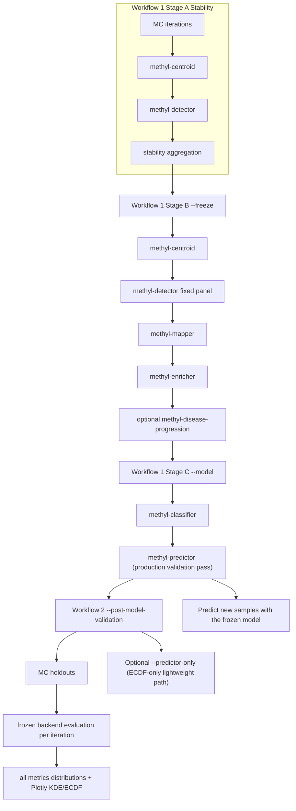

# MethylValidation Usage Guide

## Overview

MethylValidation orchestrates repeated train/validation splits, **methyl-centroid + methyl-detector** per iteration, aggregation of **detector** (or **predictor** when using `--predictor-only`) metrics, then optional **--freeze** (mapper/enricher) and **--model** (classifier→predictor). It supports two primary workflows:

1. **Model Creation** (`--stability` + `--freeze` + `--model`) — Identify stable DMPs across many random splits, extract pathways, and then build a final production model on all data.
2. **Post-model Validation** (`--post-model-validation`) — Evaluate a frozen production model on random holdouts without retraining and export KDE/ECDF metric distributions.
3. **Model Use for Prediction** (`--predictor-only`) — Lightweight predictor-only MC runs for ECDF projects that need repeated predictor validation.
4. **Disease Progression Synthesis** (`step_config.progression.enabled`) — After freeze, aggregate per-stage mapper/enricher outputs into cross-stage progression tables.

Both workflows are controlled by the project configuration file. See the full Quarto documentation at `docs/theory/` for theoretical background and the complete configuration reference.

---

## Two Workflows

### Workflow 1: Model Creation

**Purpose:** Build a robust, production-ready classifier by identifying consistently recurring DMPs across random data partitions.

**Steps:**

```bash
# Step 1: Monte Carlo + stability (n_iterations: centroid + detector per split)
methyl-validation --project configs/my_project.json --stability

# Step 2: Production freeze (full pipeline on all data up to mapper/enricher)
methyl-validation --project configs/my_project.json --freeze

# Step 3: Production model (after reviewing pathways, train the classifier and validate)
methyl-validation --project configs/my_project.json --model
```

**Why this workflow?**

- Monte Carlo splits refit centroids and detection on training fractions; **balanced_accuracy** in `all_metrics.csv` comes from **MethylDetector** validation (mean over `result*.json`) unless you use **`--predictor-only`** with a frozen model.
- Stability analysis identifies DMPs that recur in ≥ `stability_dmp_freq` fraction of runs.
- The freeze step prepares the final data using only the stable positions (`fixed_dmp_panel`), bypassing re-discovery, and extracting the valid pathway families (genes).
- The model step builds the final model from the verified DMPs and predicts on the test set.

**Output:** `monte_carlo_runs/production/classifiers/multiclass-classifier.pkl` is the final production model (created after `--model`).

### Workflow mental model



### Workflow 2: Model Use for Prediction

**Purpose:** Measure empirical distributions of frozen-model performance on held-out samples after model build.

**Prerequisites:** Workflow 1 must have been completed (`production/project.json` must exist).

```bash
methyl-validation --project configs/my_project.json --post-model-validation
```

**Why this workflow?**

- Uses frozen artifacts only (no retraining).
- Supports all model backends: `ecdf`, `tabular_sklearn`, `generative_hybrid`.
- Provides empirical distributions for multiple metrics (`balanced_accuracy`, `sensitivity`, `specificity`, `macro_f1`, etc.).
- Exports `metrics_distributions_plotly.html` with KDE and ECDF for each metric.
- Uses the same stratified splitting logic as Workflow 1 for consistency.

---

## CLI Flags

### Which steps run (CLI package mapping)

| Mode / Flag | Main steps that run |
|---|---|
| Monte Carlo loop (`methyl-validation` default, optional `--stability`) | Per iteration: `methyl-centroid` + `methyl-detector` |
| `--stability` | Uses the same Monte Carlo loop above, then runs stability aggregation over discovery DMP outputs (`run_stability_analysis`) |
| `--freeze` | `methyl-centroid` + `methyl-detector` (fixed panel) + `methyl-mapper` + `methyl-enricher` + optional `methyl-disease-progression` |
| `--model` (`model_backend="ecdf"`) | `methyl-classifier` + `methyl-predictor` on frozen `production/project.json` |
| `--model` (`model_backend="tabular_sklearn"` / `"generative_hybrid"`) | In-process backend flow: model bundle -> train -> predict (consumes freeze outputs; does not re-run `methyl-detector`) |
| `--post-model-validation` | MC holdout evaluation on frozen production artifacts (no retraining): `ecdf` uses predictor-only runs, tabular/generative use frozen model inference |
| `--predictor-only` | Monte Carlo iterations where each iteration runs only `methyl-predictor` with frozen artifacts |

| Flag | Description | Main subprocesses / backend path |
|------|-------------|----------------------------------|
| `--project PATH` | Path to the project JSON (preferred; reads `step_config.validation` from the project). | Controls whichever path you select (`--stability`, `--freeze`, `--model`, or `--predictor-only`). |
| `--config PATH` | Path to a standalone Monte Carlo config JSON (alternative to `--project`). | Same as above, but from MC config file mode. |
| `--stability` | Run stability analysis after the MC loop (Workflow 1, Step 1). | MC loop (`methyl-centroid` + `methyl-detector`) then in-process stability aggregation. |
| `--stability-featurecuts` | Enable detector FeatureCuts during MC (`classifier_dmp_selection=featurecuts_validation`) and compute stability from classifier-panel DMP exports. | Detector step override per run + classifier-panel stability aggregation. |
| `--stability-target-ba BA` | In FeatureCuts mode, target balanced accuracy used to pick minimum top-k DMPs by effect size. | Detector FeatureCuts target-BA selection (`target_balanced_accuracy`). |
| `--stability-min-selected-dmps N` | In FeatureCuts mode, enforce minimum selected DMP count per run. | Detector lower bound (`min_selected_dmps`) after FeatureCuts selection. |
| `--skip-centroid` | Reuse existing per-run centroids and run detector only (no centroid recomputation). Useful when tuning `step_config.detection` hyperparameters on the same MC splits. | MC loop runs detector-only using existing `run_XXXX/project.json` and centroid artifacts. |
| `--resume [RUN]` | Resume interrupted MC runs for `--stability` / default MC mode. Without `RUN`, repeats the last existing run and continues to `n_iterations`; with `RUN` (1-based), restarts from that run. | MC loop resume control (run directories `run_0001`, `run_0002`, ...). |
| `--freeze` | Run production freeze using the stable DMP panel, up to enricher (Workflow 1, Step 2). If `step_config.progression.enabled=true`, this also runs `methyl-disease-progression` after enricher. | `methyl-centroid` -> `methyl-detector` (fixed panel) -> `methyl-mapper` -> `methyl-enricher` (+ optional progression). |
| `--model` | Run production model builder after freeze (Workflow 1, Step 3). | `ecdf`: `methyl-classifier` -> `methyl-predictor`; other backends: bundle -> train -> predict. |
| `--post-model-validation` | Run descriptive MC holdout evaluation with frozen production artifacts (no retraining). | `ecdf`: predictor-only evaluation; tabular/generative: in-process frozen model predict. Outputs to `monte_carlo_runs/post_model_validation/`. |
| `--predictor-only` | Run only `methyl-predictor` per iteration using the frozen model (Workflow 2). | Monte Carlo iterations, predictor only. |
| `--skip-enricher` | Skip the enricher inside MC iterations even when `run_mapper_and_enricher: true`. | Also short-circuits enricher (and therefore progression) in `--freeze`. |
| `--iterations N` | Override `n_iterations` from config. | Affects MC loop count (`--stability` and `--predictor-only`). |
| `--seed S` | Override `seed` from config. | Affects MC split reproducibility. |
| `--output-base DIR` | Override `output_base` from config. | Affects all output roots. |

---

## Setup

### Option 1: Virtual environment (recommended for development)

```bash
cd /path/to/MethylPipeline
source .venv/bin/activate
methyl-validation --project configs/my_project.json --stability
```

### Option 2: Docker container

```bash
cd /path/to/MethylPipeline/docker
docker compose up -d
docker exec -w /workspace methylpipeline \
  methyl-validation --project /workspace/configs/my_project.json --stability
```

Paths in the config must be valid **inside** the container.

---

## Project Config: `step_config.validation`

Rather than a separate Monte Carlo config file, embed the validation settings directly in the project file. Only MC-specific fields are needed here; `samples_base_path`, `output_base`, and the cohort structure are inherited from the top-level project fields.

```json
"step_config": {
  "validation": {
    "train_fraction": 0.8,
    "n_iterations": 50,
    "seed": 42,
    "run_stability": true,
    "stability_dmp_freq": 0.7,
    "stability_min_balanced_accuracy": null,
    "abort_on_step_failure": false
  }
}
```

All `step_config.validation` fields are documented in the configuration reference (see `docs/theory/chapters/13-configuration-reference.qmd` or the Quarto book at `docs/theory/`).

### Covariate contract for `tabular_sklearn` / `generative_hybrid`

Covariates are backend-specific and are **not** used by the ECDF Bayesian path.

- **Join key:** `covariate_id_column` must match sample folder basename (for example `S123` from `/path/to/S123`).
- **Input formats:** `.csv` / `.tsv` or `.h5`/`.hdf5` sidecar (`sample_id`, `values`, optional `columns`).
- **Column roles:** inferred by default, or fixed via `covariate_numeric_columns`, `covariate_ordinal_columns`, and `covariate_categorical_columns`.
- **Numeric preprocessing:** impute via `covariate_missing_numeric_strategy` (`mean`, `median`, `zero`) then optional z-score (`covariate_standardize_numeric`).
- **Ordinal preprocessing:** mapped to ordered numeric codes (single feature per column) using `covariate_ordinal_maps`; if omitted, known label sets like `low/medium/high` are auto-mapped; unknown/missing values use `covariate_ordinal_unknown_value`.
- **Categorical preprocessing:** one-hot with frozen vocab and `__UNKNOWN__` bucket at inference.
- **Strictness:** `covariates_strict_join` (tabular) and `generative_covariates_strict` (generative) enforce one-to-one sample id coverage.

Example (`step_config.validation`) using all covariate types:

```json
"validation": {
  "model_backend": "generative_hybrid",
  "covariates_path": "/data/covariates.csv",
  "covariate_id_column": "sample_id",
  "covariate_numeric_columns": ["age", "bmi", "visceral_fat_pct"],
  "covariate_ordinal_columns": ["risk_band"],
  "covariate_ordinal_maps": {
    "risk_band": {
      "low": 1,
      "medium": 2,
      "high": 3
    }
  },
  "covariate_ordinal_unknown_value": 0,
  "covariate_categorical_columns": ["ethnicity", "center"],
  "covariate_missing_numeric_strategy": "median",
  "covariate_standardize_numeric": true
}
```

### Optional: `step_config.progression`

`methyl-validation` reads progression settings from `step_config.progression` in the project JSON when running `--freeze`:

```json
"step_config": {
  "progression": {
    "enabled": true,
    "ordered_comparison_labels": ["pca_pca1", "pca_pca2", "pca_pca3", "pca_pca4"],
    "strict_missing": false,
    "report_md": true
  }
}
```

- `enabled`: run `methyl-disease-progression` after `methyl-enricher` in freeze.
- `ordered_comparison_labels`: explicit stage order (optional; defaults to project comparison order).
- `strict_missing`: fail progression if any expected stage file is missing.
- `report_md`: emit `progression/report.md` in addition to CSV/JSON outputs.

### Canonical vs legacy config keys

Prefer these canonical keys in project files:

- `step_config.predictor` (legacy alias `step_config.validator` is deprecated)
- `step_config.enricher.input_file` / `step_config.enricher.output_dir` (legacy `input` / `outdir` are deprecated)
- `step_config.detection.ecdf_grid_size` (legacy aliases `ecdf_overlap_grid_size`, `ecdf_ks_grid_size` are deprecated)

---

## Outputs

All outputs are under `output_base/project_name/monte_carlo_runs/`:

| File / Directory | Description |
|-----------------|-------------|
| `run_000N/` | Per-iteration directory: `project.json`, train/val CSVs, pipeline outputs, `logs/` (binary centroid runs write `methyl-centroid-group1.log` and `methyl-centroid-group2.log`), `predictors/validation_metrics.json`. |
| `all_metrics.csv` | One row per successful iteration: `iteration`, `run_id`, `accuracy`, `balanced_accuracy`, `macro_f1`, `n_samples`, `n_classes`, etc. |
| `metrics_summary.json` | Per-metric empirical distribution: `mean`, `std`, `min`, `max`, `count`, `p5`, `p25`, `p50`, `p75`, `p95`. |
| `step_timings.csv` | Per step per run: `step_name`, `duration_seconds`, `return_code`, `run_id`, `n_train_samples`, `n_val_samples`, optional `n_processed_samples` for centroid rows. Binary MC runs include separate `methyl-centroid-group1` and `methyl-centroid-group2` rows. |
| `resource_summary.json` | Mean/std duration per step and range summaries for train/val sizes; includes `n_processed_samples` when present. |
| `stability/stable_dmps_production.csv` | Stable DMP panel (created by `--stability`). |
| `stability/dmp_frequency_by_chromosome.html` | Combined Plotly chart with one series per chromosome (both `all` and `selected` traces): X = DMP frequency across runs (%), Y = DMP count. |
| `stability/dmp_frequency_chr_<chrom>.html` | Per-chromosome Plotly chart files, each showing `all` vs `selected` DMP count distributions over frequency (%). |
| `stability/stability_summary.json` | Stability run summary for DMP/gene frequency plus detector parameter extraction. Includes `detector_parameters.per_run` and `detector_parameters.aggregates` built from `detections/**/results-*.json` (minimal fields: exported/statistical/biological DMP totals, `effect_size_coverage`, `delta_mean_reduction`, `classifier_dmp_selection`, `dynamic_dmp_cutoff_enabled`). |
| `production/project.json` | Frozen production project with `fixed_dmp_panel` in `step_config.detection`. |
| `post_model_validation/run_000N/` | Per-iteration post-model holdout evaluation outputs and logs. |
| `post_model_validation/all_metrics.csv` | One row per successful post-model iteration with scalar metrics. |
| `post_model_validation/metrics_summary.json` | Empirical distribution summary of post-model metrics. |
| `post_model_validation/metrics_distributions_plotly.html` | Plotly chart with KDE and ECDF for all numeric metrics. |
| `production/progression/` | Disease progression synthesis outputs (`genes_long.csv`, `pathways_long.csv`, `modules_long.csv`, `entities_progression_labels.csv`, `summary.json`, optional `report.md`). |
| `production/classifiers/multiclass-classifier.pkl` | **Final production model.** |
| `production/production_summary.json` | Production freeze summary. |

---

## Three Key Diagnostics

### 1. Low DMP coverage (`dmps_used_fraction_median` < 0.5)

**Cause:** `min_sample_coverage` in `step_config.detection` > centroid `min_coverage` in `step_config.centroid.base_config`.

**Fix:**
```json
"centroid": { "base_config": { "min_coverage": 4 } },
"detection": { "min_coverage": 4, "min_sample_coverage": 4 }
```

### 2. Class imbalance (majority class recall ≈ 1.0, others ≈ 0)

**Cause:** Imbalanced cohort (e.g. 2–4× more healthy than disease samples).

**Fix:**
```json
"detection": {
  "multiclass_train_learned_head": true,
  "multiclass_learned_class_weight": "balanced"
}
```

### 3. sklearn version mismatch (`InconsistentVersionWarning`)

**Cause:** Model was trained with a different sklearn version than the one currently installed.

**Fix:** Re-run `--freeze`. The new model PKL will record `sklearn_version` in its metadata.

---

## Troubleshooting

| Problem | Fix |
|---------|-----|
| `command not found: methyl-validation` | Activate the venv: `source .venv/bin/activate` |
| `Monte Carlo config needs at least two cohorts` | Use `--project` not `--config` when passing a project file |
| `step_config.validation not found` | Add the `validation` block to your project's `step_config` |
| `FileNotFoundError: fixed_dmp_panel not found` | Run `--stability` before `--freeze` |
| `Blind predictor: blind mode rejected` | Remove `blind` from `step_config.predictor` |
| Stability panel is empty | Lower `stability_dmp_freq` or increase `n_iterations` |

---

## Related Documentation

- **Theory and algorithms:** `docs/theory/` (Quarto book)
- **Two workflows in depth:** `docs/theory/chapters/12-two-workflows.qmd`
- **Full configuration reference:** `docs/theory/chapters/13-configuration-reference.qmd`
- **User guide:** `docs/theory/chapters/14-user-guide.qmd`
- **Implementation notes:** `packages/methylvalidation/docs/IMPLEMENTATION.md`
