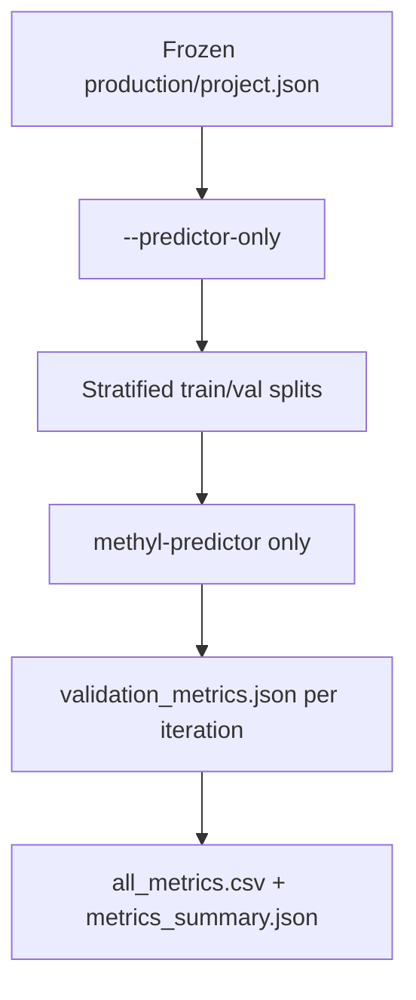

# MethylValidation Usage Guide

## Overview

MethylValidation supports **two distinct workflows**:

1. **Model Creation** — Build a stable, production-ready model using Monte Carlo validation, stability analysis, and a final production freeze.
2. **Model Use for Prediction** — Evaluate or deploy the frozen production model on new data using predictor-only mode.

---

## Workflow 1: Model Creation

**Purpose**: Create a robust production model by identifying stable DMPs across many random splits and building a final model on the full dataset.

### Steps

1. Create a `monte_carlo_config.json` (see [Config](#config) section below).
2. Run full Monte Carlo with stability analysis:
   ```bash
   methyl-validation --config monte_carlo_config.json --stability
   ```
3. Run the production freeze to build the final model:
   ```bash
   methyl-validation --config monte_carlo_config.json --freeze
   ```

### Why this workflow?

- Monte Carlo + stability identifies **consistently recurring DMPs** across random data splits (robustness).
- The `--freeze` step builds a **single high-quality production model** on the full dataset using the stable DMP panel.
- The `fixed_dmp_panel` option in MethylDetector bypasses statistical/biological discovery and uses only the stable positions.
- Output: production classifier, mapper, and enricher results in `monte_carlo_runs/production/`.

```mermaid
flowchart TD
    Config[monte_carlo_config.json] --> MC[Monte Carlo + --stability]
    MC --> Stability[stable_dmps_production.csv]
    Stability --> Freeze[--freeze]
    Freeze --> Merge[Merge stable DMPs]
    Merge --> ProdProject[production/project.json with fixed_dmp_panel]
    ProdProject --> Pipeline[centroid → detector(fixed panel) → classifier → mapper → enricher]
    Pipeline --> Output[production/ directory with final model]
```

---

## Workflow 2: Model Use for Prediction

**Purpose**: Evaluate the performance of the frozen production model on multiple random holdouts without retraining.

### Steps

1. Complete **Workflow 1** first (to create the frozen model).
2. Use the same (or similar) config file with `predictor_only: true` (or use `--predictor-only` flag).
3. Run predictor-only evaluation:
   ```bash
   methyl-validation --config monte_carlo_config.json --predictor-only
   ```

### Why this workflow?

- Much faster than full MC (only runs `methyl-predictor`).
- Provides the **empirical performance distribution** of the *final production model*.
- Uses the same stratified splitting logic as Model Creation for fair comparison.



---

## Flags

- `--stability` — run stability analysis after MC (part of Model Creation)
- `--freeze` — run production freeze (final step of Model Creation)
- `--predictor-only` — run only predictor against frozen model (Model Use for Prediction)
- `--skip-enricher` — skip enricher during MC iterations

---

## Setup

*(The rest of the original documentation continues below...)*

There are **two ways** to run MethylValidation:

1. **Docker container** — Run inside the MethylPipeline image.
2. **Local host with virtual environment** — Create and activate a venv.

*(Original setup, config, outputs, and troubleshooting sections follow...)*
