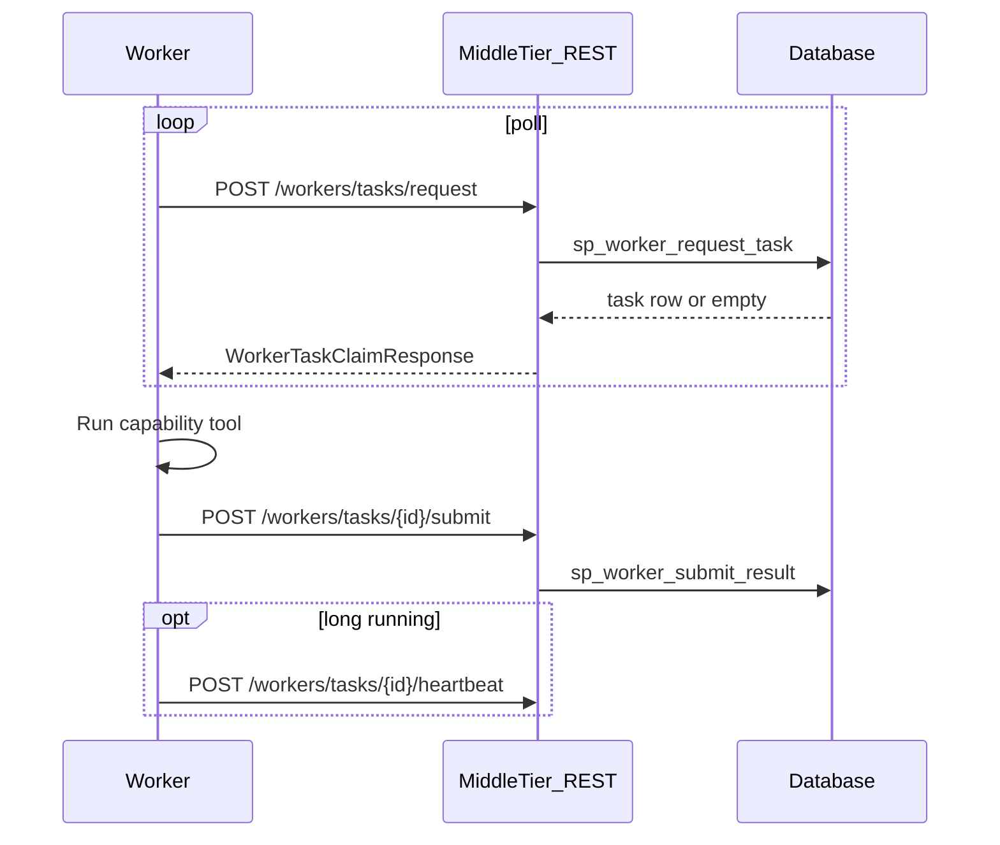

# Remote Worker Protocol

Language-neutral contract for HPC/cloud workers executing workflow ACTION nodes.
Workers **must not** connect to the database directly; they use the REST API defined in
[`../contracts/openapi.yaml`](../contracts/openapi.yaml).

## Flow



## Capability strings

Map to `wf.workflow_action.capability` (e.g. `methyl-centroid`, `methyl-detector`).
The reference worker dispatches to local `methyl-*` CLIs based on `action_name` or
`input_json.workerTool*`.

## Result codes

- `result_code >= 0`: success; advances workflow
- `result_code < 0`: fails the workflow instance

## Implementing a worker in any language

1. Load OpenAPI spec from `contracts/openapi.yaml`
2. Poll `POST /workers/tasks/request` with `worker_id`, `worker_token`, optional `capability`
3. Parse `input_json` from the claim response
4. Execute domain logic
5. `POST /workers/tasks/{nodeExecutionId}/submit` with `output_json`
6. Optionally heartbeat during long jobs

## Reference implementation

Python package [`methyl_worker/`](methyl_worker/):

```bash
source .venv/bin/activate
pip install -e workers/

# Poll for methyl-qc tasks (credentials from portal worker registration)
export WORKER_ID=1 WORKER_TOKEN='...' WORKER_CAPABILITY=methyl-qc
methyl-worker --api-base http://localhost:8080/v1

# Dry-run external capabilities (download, Parabricks, extract, delete)
export WORKER_STUB_EXTERNAL=1
methyl-worker --capability sample.download-fastq

# One-shot claim (debug)
methyl-worker --once
```

Modules:

| Module | Role |
|--------|------|
| [`methyl_worker/client.py`](methyl_worker/client.py) | REST client (`request`, `submit`, `heartbeat`, `fail`) |
| [`methyl_worker/handlers.py`](methyl_worker/handlers.py) | Capability dispatch to methyl-* CLIs and sample-prep handlers |
| [`methyl_worker/runner.py`](methyl_worker/runner.py) | Poll loop with background heartbeat |

Legacy shim: [`reference_rest_worker.py`](reference_rest_worker.py) delegates to `methyl-worker`.

## Database contract (middle-tier only)

If implementing a new middle-tier language, call the same DB objects documented in
[`../workflow_engine/contract/db_objects.yaml`](../workflow_engine/contract/db_objects.yaml)
rather than duplicating SQL in application code.
