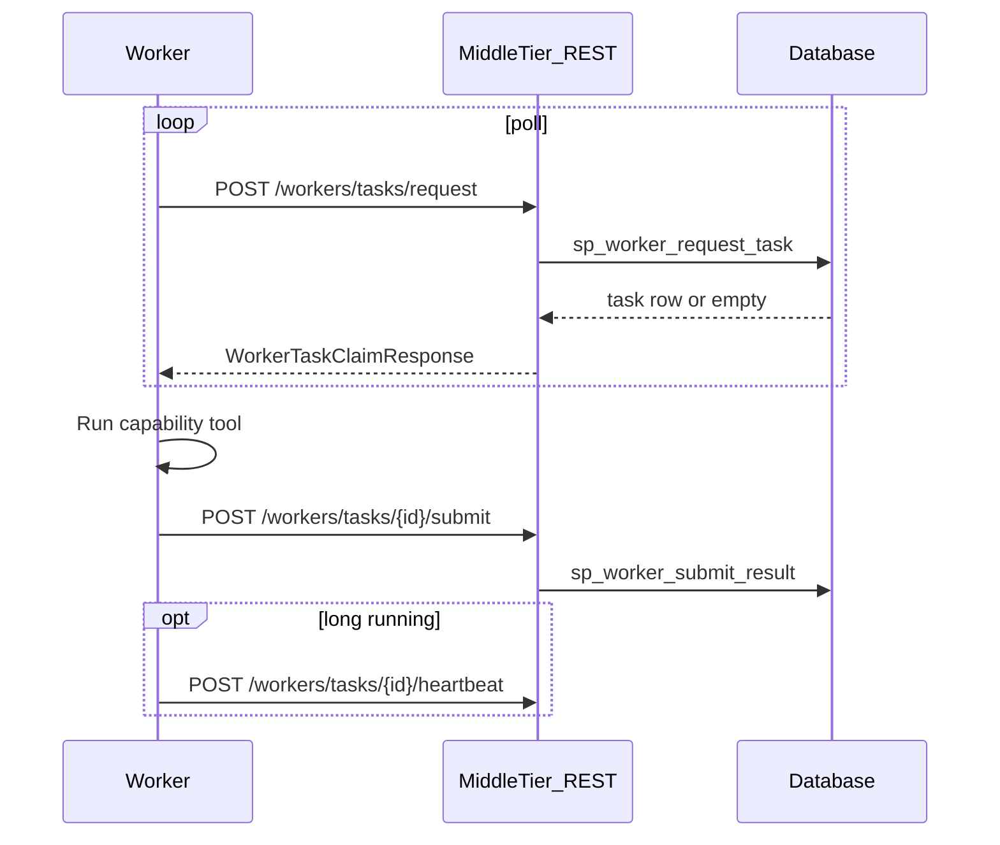

# Remote Worker Protocol

Language-neutral contract for HPC/cloud workers executing workflow ACTION nodes.
Workers **must not** connect to the database directly; they use the REST API defined in
[`../contracts/openapi.yaml`](../contracts/openapi.yaml).

## Flow



## Capability strings

Map to `wf.workflow_action.capability` (e.g. `methyl-centroid`, `methyl-detector`).
The reference worker dispatches via **ActionBase** (`CliAction` / `InProcessAction`) using metadata from `schemas/actions/catalog.json` (`execution_mode`, `cli_tool`, `argv_map`). Live DB rows mirror catalog fields after `seed_action_catalog.py`; the gateway does **not** expose `GET /v1/actions`.

## Result codes

Branch codes are stored on `node_execution.result_code` and drive IF/SWITCH via `wf_try_task_result_code`:

| Code | Meaning |
|------|---------|
| `< 0` | Hard failure; workflow instance fails |
| `0` | Default success / false branch |
| `1` | True branch (e.g. `sample.methyl_qc` needs realign/trim) |
| `2..N` | Multi-way SWITCH cases (document per action) |

Every successful submit includes a **typed** `output_json` (Pydantic `extra="forbid"`, exported under `schemas/tasks/`). Each output carries telemetry: `started_at_utc`, `finished_at_utc`, `duration_ms`, `exit_code`, `manifest_path`, and `artifacts[]`.

### Action result manifests on `/work`

CLI tools write JSON manifests under `{output_dir}/.action_results/{action_name}.{run_key}.json` (see `methyl_domain.action_result`). Manifest schema **1.1** (`ActionExecutionRecord`) adds idempotency fields: `action_revision`, `input_signature`, `output_signature`, and optional `skipped` / `skip_reason`. Before executing, `execute_task()` compares these signatures against the stored manifest; when they match and output artifacts verify, the worker **replays** the cached result (`status: "skipped"`) instead of re-running.

The worker reads and validates manifests after subprocess exit; legacy artifact scraping remains as fallback until all tools emit manifests.

Sample prep also appends `{sampleDir}/{sampleId}.sample_prep_log.jsonl` for an operator-visible timeline.

Workflow runs append a unified `{logRoot}/action_run_log.jsonl` with one line per ACTION (pipeline, validation, sample prep when a log root resolves). Each record includes timing (`started_at_utc`, `finished_at_utc`, `duration_ms`), branch fields (`result_code`, `status`, `exit_code`), full typed `inputs` and `outputs`, plus `skipped`, `action_revision`, and signature fields when idempotent skip applies.

Log root resolution: explicit `monteCarloRunsRoot`, any path under `monte_carlo_runs/`, validation project output, project output base, or `sampleDir`.

**FOREACH:** each action inside an MC iteration still skips independently via CAAS / `{runDir}/.action_results/`. In addition, the scheduler may **short-circuit a whole BODY iteration** when an iteration-bundle content key hits under `{project_root}/.caas/foreach_bundle/` (local engine) or `wf.foreach_bundle_entry` (DB engine). The key includes nested parent FOREACH ancestry so identical leaf items under different parents (e.g. context `CG` under control vs disease seed groups) do not collide. On hit, BODY children are not claimed; on miss, normal fan-out runs and a successful BODY commits the bundle. DB skip requires the same `content_key`; without it, skip is a no-op.

**Force re-execute:** pass `forceRerun: true` in task input, set context `forceRerun` on local runs, use `methyl-workflow-run --force-rerun`, or export `METHYL_FORCE_RERUN=1`.

### `sample.methyl_qc` branch codes

| Code | Meaning |
|------|---------|
| `0` | QC pass |
| `1` | Needs realign/trim (`remediateAlignment`) |
| `2` | Permanent fail → `sample.qc_failed` |

## Implementing a worker in any language

1. Load OpenAPI spec from `contracts/openapi.yaml`
2. **Production:** Portal preregisters `(cluster_key, public_ip, external_worker_key)` via
   `portal.sp_upsert_worker_enrollment`, then the VM calls
   `POST /workers/enroll` (`methyl-worker enroll --api-base … --cluster … --key …`) and stores
   `/etc/methyl/worker-token` (mode 600). HTTP 403 fails closed (IP/key not preregistered).
   Direct-DB `scripts/register_worker.py` requires `METHYL_ALLOW_WORKER_SQL=1` (lab only).
3. Poll `POST /workers/tasks/request` with `worker_id`, `worker_token`, optional `capability` **narrowing filter**
4. Honor `desired_state` / `command` on the response (`DRAIN`/`STOP` → no new claims; while running, heartbeat echoes the same and may abort if catalog `control.can_stop`)
5. Parse `input_json` from the claim response when `has_task`
6. Execute domain logic
6. `POST /workers/tasks/{nodeExecutionId}/submit` with `output_json`
7. Optionally heartbeat during long jobs

### Capability-based dispatch

The engine **only returns tasks whose `wa.capability` is in the worker's registered**
`wf.worker.capabilities` JSON array. A worker never receives a task it cannot run.

| Registration | Dispatch |
|--------------|----------|
| `NULL`, `[]`, or `["*"]` | Omnibus (legacy — any capability) |
| `["methyl-centroid", "methyl-detector", …]` | Only matching READY tasks |

The poll request's optional `capability` field **narrows** within the registered set
(e.g. `methyl-worker@methyl-centroid.service` sets `WORKER_CAPABILITY=methyl-centroid`).
It cannot widen beyond registration.

Auto-detect capabilities on enroll/register when supported, or
`methyl_worker.capabilities.resolve_worker_capabilities()`.

Workers send `X-Arc-Resource-Id` (from `/etc/methyl/arc.env`) when polling if the gateway
has `GATEWAY_REQUIRE_ARC_ATTEST=1`. **Production clusters should leave this enabled.**

Credentials: prefer `/etc/methyl/worker-token` (mode 600), not shared `/work` env files.
Storage cloud keys arrive in claim `input_json` only; optional node-local Fernet cache lives under
`/var/lib/methyl/storage-credentials/` with wrap key `/etc/methyl/storage-credential.key`.
Never write cloud secrets under `/work`. Do not log credential bodies.

## Reference implementation

Python package [`methyl_worker/`](methyl_worker/):

```bash
source .venv/bin/activate
pip install -e workers/

# Poll for methyl-qc tasks (worker_token from registration; storage secrets arrive in claim input_json)
export WORKER_ID=1 WORKER_TOKEN='...' WORKER_CAPABILITY=methyl-qc
methyl-worker --api-base http://localhost:8080/v1

# Dry-run external capabilities (download, Parabricks, extract, delete)
export WORKER_STUB_EXTERNAL=1
methyl-worker --capability sample.download-fastq

# Monte Carlo planner (local CLI, no workflow poll)
methyl-worker plan-iterations --plan-input /path/to/plan_request.json

# Register worker with capability validation.plan-iterations to run planner as a workflow ACTION
export WORKER_CAPABILITY=validation.plan-iterations
methyl-worker --api-base http://localhost:8080/v1

# One-shot claim (debug)
methyl-worker --once
```

Modules:

| Module | Role |
|--------|------|
| [`methyl_worker/client.py`](methyl_worker/client.py) | REST client (`request`, `submit`, `heartbeat`, `fail`) |
| `methyl_worker/handlers/` | Capability dispatch to methyl-* CLIs, sample-prep handlers, and **`validation.plan-iterations`** (Monte Carlo planner); CLI providers via `actions/registry.py` |
| `methyl_worker/depends.py` | Worker-local `Depends` for in-process handlers (`TaskRuntimeContext`, logger, path helpers) — not used by the SQL engine/gateway |
| [`methyl_worker/runner.py`](methyl_worker/runner.py) | Poll loop with background heartbeat |

Legacy shim: [`reference_rest_worker.py`](reference_rest_worker.py) delegates to `methyl-worker`.

## Full staged pipeline (SamplePrep + StudyValidation)

The reference worker can execute **every action** in both workflow instances when the node environment is provisioned correctly. See [`../workflow_engine/docs/portal_study_lifecycle.md`](../workflow_engine/docs/portal_study_lifecycle.md) for portal orchestration.

### Install (not `pip install -e workers/` alone)

Handlers import the full monorepo (`methyl_alignment_qc`, `methyl_fragmentomics`, `methyl_validation`, …). Production nodes need editable installs of all packages:

```bash
source .venv/bin/activate
./scripts/install_all.sh    # or scripts/setup_host.sh on a fresh HPC image
pip install -e workers/
```

Console scripts on `PATH` must include: `methyl-centroid`, `methyl-detector`, `methyl-mapper`, `methyl-enricher`, `methyl-disease-progression`, `methyl-qc`, `methyl-extraction-qc`, plus native **`MethylExtractor`** and Docker **Parabricks** for sample prep.

### Capability fleet

`WorkerRunner` filters tasks when `WORKER_CAPABILITY` is set. For the full lifecycle, either:

| Approach | When to use |
|----------|-------------|
| **One worker, no `WORKER_CAPABILITY`** | Dev / small cluster; single process polls any task (must have full stack + GPU for Parabricks tasks) |
| **Per-capability workers** | Production; register multiple worker IDs, each with one capability |

| Stage | Capability | Execution |
|-------|------------|-----------|
| Sample prep | `sample.download-fastq`, `parabricks.fq2bam`, `sample.trim-fastq`, `sample.delete-fastqs`, `methyl-qc`, `methyl-fragmentomics`, `methyl-extract`, `methyl-extraction-qc`, `sample.upload-h5`, `sample.delete-bam`, `sample.mark-failed` | in-process / external GPU |
| Feature MC / freeze | `methyl-centroid`, `methyl-detector` | CLI subprocess |
| Biological | `methyl-mapper`, `methyl-enricher`, `methyl-disease-progression` | CLI (`--project`) |
| Validation | `validation.plan-iterations`, `validation.stability`, `validation.prepare-freeze-project`, `validation.stability-freeze-readiness`, `validation.model-mc`, `validation.select-best-model`, `validation.post-model-validation` | in-process |

`pipeline.detector` uses **`DetectorCliAction`**: workflow `comparison` → `--group`; `chromosome`, `context`, `fixedDmpPanel`, and `outputDir` are folded into `--step-override` JSON (methyl-detector has no per-chromosome CLI flags).

### Dry-run

`WORKER_STUB_EXTERNAL=1` fakes download, Parabricks, extract, and delete only. It does **not** stub pipeline CLI or validation actions.

## Database contract (middle-tier only)

If implementing a new middle-tier language, call the same DB objects documented in
[`../workflow_engine/contract/db_objects.yaml`](../workflow_engine/contract/db_objects.yaml)
rather than duplicating SQL in application code.
