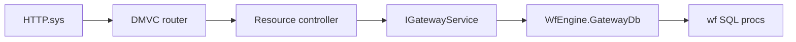

# Workflow Engine Delphi REST Gateway

The Delphi middle-tier in `workflow_engine/src` is a **thin REST gateway** between workers (and other clients) and the `wf` SQL contract. It mirrors the Python reference gateway in `workflow_engine/rest/gateway.py`.

Workflow activation, control flow, scope resolution, and task progression run **in the database** (`sp_start_workflow_instance`, `sp_worker_submit_result`, `wf_engine_activate`, and related procs). Delphi does not embed an inline engine.

The gateway is built on [DelphiMVCFramework](https://github.com/danieleteti/delphimvcframework) (DMVC) and runs as a **Windows service** (`MethylWfGateway`) that can be started, paused, resumed, and stopped through the Service Control Manager.

It uses DMVC's pluggable server backend (`IMVCServer`) with the **HTTP.sys** driver (`TMVCServerFactory.CreateHttpSys` → `TMVCHttpSysServer`): the Windows kernel-mode HTTP stack (same as IIS/Kestrel), engine-first — no WebBroker module, no Indy sockets.

## Components

| Unit | Role |
|------|------|
| `WfEngine.Mvc.Service.pas` (`TMethylWfGatewayService`) | Windows service; SCM start/pause/continue/stop |
| `WfEngine.Mvc.Server.pas` (`TWfGatewayServer`) | Standalone `TMVCEngine` + HTTP.sys `IMVCServer`; registers `IGatewayService` for DI |
| `WfEngine.Mvc.WorkersController.pas` | DMVC worker routes (`MVCFromBody`, `IMVCResponse`) |
| `WfEngine.Mvc.WorkflowsController.pas` | DMVC workflow admin routes |
| `WfEngine.Mvc.ActionsController.pas` | DMVC action schema catalog routes |
| `WfEngine.GatewayHost.pas` | Shared `TWorkflowEngineHostedService` + `IGatewayService` lifecycle |
| `WfEngine.GatewayService.pas` | One method per OpenAPI operation; delegates all DB access to `GatewayDb` |
| `WfEngine.GatewayDtos.pas` | Request/response DTOs aligned with `contracts/openapi.yaml` |
| `WfEngine.ServiceLoop.pas` (`TWorkflowEngineHostedService`) | UniDAC connection lifecycle |
| `WfEngine.GatewayDb.pas` | Sole DB layer: all `wf` contract procs via `TUniStoredProc` (no inline SQL) |
| `WfEngine.WorkerApiAdapter.pas` | Worker `sp_worker_*` calls; auth/submit via `GatewayDb` |
| `WfEngine.Connection.pas` | Connection config from env; UniDAC provider setup; managed identity (IMDS) |

`WfEnginePkg` (runtime package) contains the SQL gateway core and DTOs/service types; DMVC controller and service host units belong to the `WfEngineSrv` executable, which requires DMVC ≥ 3.5 on the project search path.

## DMVC request flow



Each controller action is the real handler: path segments bind to Delphi parameters (`NodeExecutionId`, `InstanceId`, …), bodies bind via `[MVCFromBody]`, and responses use `OKResponse` / `CreatedResponse` / `NoContentResponse` / `NotFoundResponse` on typed DTOs. There is no secondary string router.

Controllers receive `IGatewayService` via `[MVCInject]`; `TWfGatewayServer` registers the singleton instance from `GetGatewayService()` after `InitGatewayHost`.

## End-to-end lifecycle

1. **Create instance** — `POST /v1/workflows/instances` calls `wf.wf_repo_create_workflow_instance`, then `wf.sp_start_workflow_instance`.
2. **Start (optional)** — `POST /v1/workflows/instances/{id}/start` calls `sp_start_workflow_instance` for instances still in `CREATED`.
3. **Claim** — worker `POST /v1/workers/tasks/request` → `wf.sp_worker_request_task`.
4. **Submit** — worker `POST /v1/workers/tasks/{id}/submit` → `wf.sp_worker_submit_result` → SQL `wf_engine_on_action_complete` advances the graph.
5. **Status** — `GET /v1/workflows/instances/{id}` reads `wf.workflow_instance`.
6. **Action schemas (Config Editor)** — `GET /v1/actions` lists registered actions; `GET /v1/actions/{name}/schema?direction=input|output` returns JSON Schema from `wf.workflow_action_schema` (seeded from `schemas/tasks/`).

All workflow state (`node_execution`, `task_lease`, `scope_variable`) lives in SQL. The gateway is stateless between HTTP calls.

## Control flow and scope (SQL)

Deploy `sql/wf_sql_runtime_parity.sql` (Azure SQL) or the PostgreSQL parity scripts under `sql_pg/` so that:

- Instance scope is seeded from `workflow_instance.context_json` at start.
- `${var.*}` placeholders resolve in SQL input templates.
- IF/SWITCH/WHILE/REPEAT/FOREACH semantics match the contract in `contract/db_objects.yaml`.

For branch resolution parity, also run `sql/wf_sql_branch_parity.sql`.

## Extension pattern (validation / Monte Carlo)

The gateway does **not** plan iterations. A planner worker (`validation.plan-iterations`) or `POST /v1/validation/plan-iterations` (Python gateway) merges `context_json.iterations[]` before start.

Preferred validation workflow seed: `sql/wf_validation_pipeline_seed.sql` → **ValidationPipeline** (FOREACH over `iterations[]`).

Contract: [`contract/validation_planner_capabilities.md`](contract/validation_planner_capabilities.md).

## Hosting (Windows service)

`WfEngineSrv.dpr` is a dual-mode host. Without switches it runs under the Service Control Manager.

Install / remove:

```
WfEngineSrv /install
WfEngineSrv /uninstall
```

Operate like any Windows service (service name `MethylWfGateway`, display name "MethylPipeline Workflow Gateway"):

```
sc start    MethylWfGateway
sc pause    MethylWfGateway     (HTTP listener suspended; DB state kept)
sc continue MethylWfGateway
sc stop     MethylWfGateway
```

Pause unregisters the HTTP.sys URL and stops accepting requests without tearing down the gateway; continue re-registers and resumes. Stop closes the listener and releases the DB connection.

Development modes:

```
WfEngineSrv /console [port=8080]                       run gateway in the foreground
WfEngineSrv /startinstance version=<id> [context={}]   one-shot instance start
```

Environment (system-level for service mode):

- `METHYLPIPELINE_DB` — UniDAC connection string (required for dev), or
- `POSTGRES_*` / `AZURE_SQL_*` — built by `WfEngine.Connection.BuildConnectionStringFromEnv`
- `BACKEND_DB` — `mssql` (default) or `postgres`
- `WF_USE_MANAGED_IDENTITY` — `1` or `true` for Azure Entra ID token auth via IMDS (production)
- `WF_GATEWAY_PORT` — HTTP port (default 8080)
- `WF_GATEWAY_HOST` — HTTP.sys binding (service default `+` = all interfaces; console default `localhost`)

### HTTP.sys URL ACL

HTTP.sys requires a URL reservation for non-privileged accounts. The service running as **LocalSystem** needs nothing extra. If you run the service under a dedicated account, reserve the URL once:

```
netsh http add urlacl url=http://+:8080/ user=DOMAIN\WfGatewayAccount
```

Console mode binds `localhost`, which needs no reservation.

Build prerequisite: DMVC ≥ 3.5 (`delphimvcframework/sources`) on the `WfEngineSrv` project search path. Build **Win64 (x64) only** — the gateway uses Windows HTTP.sys and must not be compiled for Win32 or non-Windows targets. In the IDE, select **Win64** before building; from MSBuild: `msbuild WfEngineSrv.dproj /p:Platform=Win64`. The legacy `/run` poll mode and the raw Indy host (`WfEngine.RestHttpServer`) are removed; progression is driven by worker submit and SQL procs.

## Workflow tree example

Use `sql/workflow_tree_seed_example.sql` and `sql/workflow_tree_run_example.sql` to exercise control-flow branches end-to-end via worker claim/submit against SQL activation.

Seeded workflow name: `DelphiTreeFlow`.

## Python parity

For Linux CI and reference workers, use `workflow_engine/rest/gateway.py` with the same routes and contract procs.

```bash
source .venv/bin/activate
python workflow_engine/rest/gateway.py --port 8080
```

### Action schema deploy order

After `wf_repository_api.sql` / `02_repository_api.sql`:

1. Apply [`sql/wf_action_schema.sql`](sql/wf_action_schema.sql) or [`sql_pg/wf_action_schema.sql`](sql_pg/wf_action_schema.sql).
2. Export from Pydantic: `methyl-export-task-schemas` (writes `schemas/tasks/*.schema.json`; CI gate: `methyl-export-task-schemas --check`).
3. Seed DB: `python workflow_engine/sql/seed_action_schemas.py` (PostgreSQL; Azure SQL via equivalent `sqlcmd` calling `wf.wf_repo_upsert_action_schema`).

Workers validate resolved `input_json` / handler output at runtime; the gateway serves schemas read-only for the Config Editor.
