# Configurable Methylation Pipeline — Architecture

Presentation-oriented overview of how a **project configuration** (JSON), a **schema-validated portal editor**, a **workflow database** (including **scoped variables**), a **stateless middle-tier**, and **remote workers** cooperate to run a configurable methylation pipeline on a shared-storage cluster.

**Audience:** engineers and stakeholders reviewing the company portal, backend database, middle-tier, and compute workers.

**Related code:** [`schemas/config/`](/home/ubuntu/MethylPipeline/schemas/config/), [`tools/methyl-config-editor/`](/home/ubuntu/MethylPipeline/tools/methyl-config-editor/), [`workflow_engine/`](/home/ubuntu/MethylPipeline/workflow_engine/)

**Other formats (HTML / PDF):** Quarto source is [`pipeline_architecture.qmd`](pipeline_architecture.qmd), generated from this file.

**Local HTML (diagrams need a live preview server — do not open `pipeline_architecture.html` directly in the browser or in the IDE preview):**

```bash
python workflow_engine/docs/build_pipeline_architecture_qmd.py
quarto preview workflow_engine/docs/pipeline_architecture.qmd
```

Quarto serves the page at `http://localhost:…` and Mermaid renders in your normal browser. See [Rendering](#rendering-this-document) at the end of the `.qmd` for PDF commands.

---

## Presentation map (four layers)

Two workflow definitions run in sequence: **SamplePrepPipeline** (per-sample FASTQ → HDF5) then **DataDrivenPipeline** (centroid → detector → mapper → enricher).

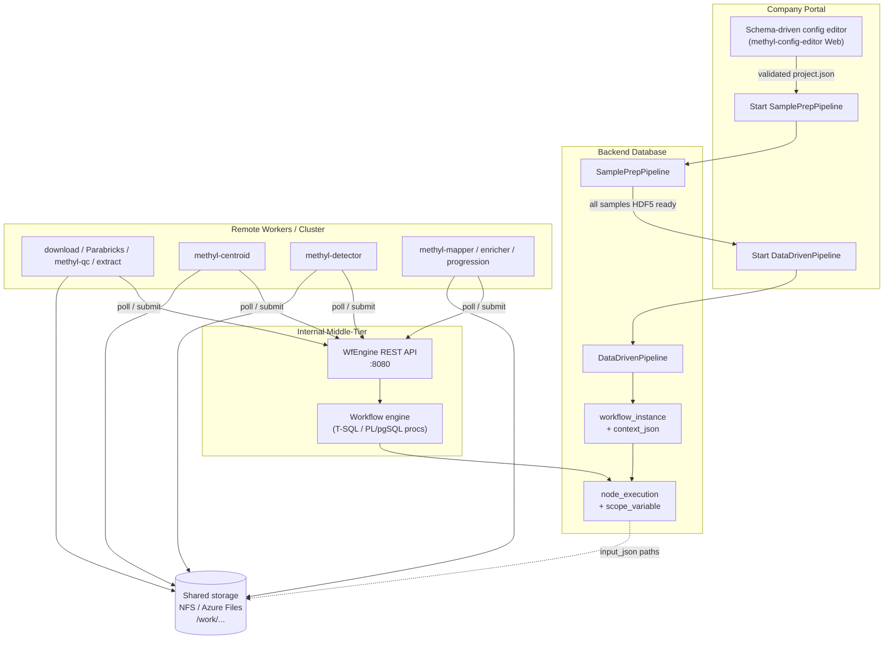

| Layer | Technology | Responsibility |
|-------|------------|----------------|
| Portal | uniGUI web app (`MethylConfigEditorWeb`) | Edit `project.json` against JSON Schema; start runs |
| Database | Azure SQL or Azure PostgreSQL (`wf` schema) | Store workflow tree, instances, executions, leases |
| Middle-tier | Delphi `WfEngine` + REST (`/v1/*`) | Stateless HTTP proxy; invokes engine stored procedures |
| Workers | Python/CLI on cluster nodes | Poll tasks by capability; read/write shared paths |

---

## 0. Per-sample upstream preprocessing (SamplePrepPipeline)

The analysis pipeline ([Section 1](#1-project-configuration) onward) assumes per-chromosome methylation HDF5 files already exist under `samples_base_path`. **SamplePrepPipeline** orchestrates ingest, alignment, QC gating, optional cfDNA fragmentomics, methylation extraction, and cleanup **per sample** before **DataDrivenPipeline** runs.

**Workflow seed:** [`workflow_engine/sql/wf_sample_prep_pipeline_seed.sql`](/home/ubuntu/MethylPipeline/workflow_engine/sql/wf_sample_prep_pipeline_seed.sql)  
**Operator guide:** [`workflow_engine/sql/SamplePrepFlow.md`](/home/ubuntu/MethylPipeline/workflow_engine/sql/SamplePrepFlow.md)  
**Worker contract:** [`workflow_engine/contract/sample_prep_capabilities.md`](/home/ubuntu/MethylPipeline/workflow_engine/contract/sample_prep_capabilities.md)  
**Analyte profiles:** [`docs/ANALYTE_PROFILES.md`](/home/ubuntu/MethylPipeline/docs/ANALYTE_PROFILES.md)

### Step order

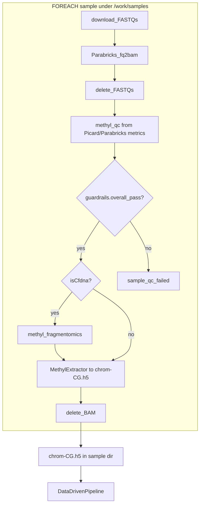

| Step | Capability | Owner | Primary outputs |
|------|------------|-------|-----------------|
| Download FASTQs | `sample.download-fastq` | External | `*.fastq.gz` in `/work/samples/{id}/` |
| Parabricks fq2bam | `parabricks.fq2bam` | External | `{id}.bam`, `{id}.json`, `*.qc-metrics.tar` |
| Delete FASTQs | `sample.delete-fastqs` | External | FASTQs removed |
| methyl-qc | `methyl-qc` | In-repo | V2 QC JSON with `guardrails.overall_pass` |
| QC gate | workflow **IF** (`qcPass`) | Engine | Skip extract on fail |
| methyl-fragmentomics | `methyl-fragmentomics` | In-repo (cfDNA only) | `{project}/fragmentomics/{id}/` |
| MethylExtractor | `methyl-extract` | External | `{chrom}-CG.h5` per project chromosome |
| Delete BAM | `sample.delete-bam` | External | BAM removed |

**Ordering:** Run **methyl-qc before methyl-fragmentomics** so failed samples do not scan BAMs. Fragmentomics still runs **before** extraction and BAM deletion (both need the aligned BAM). When `primary_analyte` is `cfdna`, the analyte profile enables fragmentomics; `buffy_coat` skips it.

### Storage contract (`/work/samples`)

```
/work/samples/{sample_id}/
  *.fastq.gz              (transient; deleted after align)
  {sample_id}.bam         (transient; deleted after extract)
  {sample_id}.json        (Parabricks metrics; retained)
  *.qc-metrics.tar        (optional; retained)
  bisulfite_conversion.json  (optional sidecar)
  1-CG.h5 … Y-CG.h5       (retained; consumed by methyl-centroid)
```

Project [`path_remap`](/home/ubuntu/MethylPipeline/packages/methylutils/methyl_utils/pipeline_config.py) bridges NAS paths to `/work/samples`. Sample list CSVs in `project.json` resolve via [`load_and_resolve_sample_paths`](/home/ubuntu/MethylPipeline/packages/methylvalidation/methyl_validation/split.py).

### QC gate semantics

- **`methyl-qc`** reads Parabricks/Picard metrics from the sample directory and writes alignment QC JSON ([`methyl_alignment_qc`](/home/ubuntu/MethylPipeline/packages/methylalignmentqc/)).
- **`guardrails.overall_pass`** (bound to scope variable `qcPass` after the QC action) drives the workflow **IF** node. Failed samples run `sample.qc_failed` and skip extraction.
- cfDNA samples additionally get insert-size guardrails via [`fragmentomics.py`](/home/ubuntu/MethylPipeline/packages/methylalignmentqc/methyl_alignment_qc/core/fragmentomics.py) when the analyte profile applies.

### Portal handoff

1. Start **SamplePrepPipeline** when FASTQs are ready (`context_json.samples[]` lists each sample).
2. On instance **COMPLETED** (all samples have HDF5 + passed QC), start **DataDrivenPipeline** with the same `projectPath`, `comparisons`, and `chromosomes`.

Example instance payload: [`workflow_engine/sql/instance_context_examples/sample_prep_plasma.json`](/home/ubuntu/MethylPipeline/workflow_engine/sql/instance_context_examples/sample_prep_plasma.json).

---

## 1. Project configuration

A **project config** is a single JSON file that describes *what* to run: cohorts, comparisons, chromosomes, contexts, and per-step tool parameters. It is the scientific contract for one methylation study.

**Canonical schema:** [`schemas/config/project_config.schema.json`](/home/ubuntu/MethylPipeline/schemas/config/project_config.schema.json)  
**Pydantic model:** [`packages/methylutils/methyl_utils/pipeline_config.py`](/home/ubuntu/MethylPipeline/packages/methylutils/methyl_utils/pipeline_config.py)  
**In-repo examples:** [`tools/methyl-config-editor/configs/`](/home/ubuntu/MethylPipeline/tools/methyl-config-editor/configs/)

### Top-level structure

Only **`project_name`** and **`output_base`** are required. Everything else is optional and validated by schema.

| Field | Role |
|-------|------|
| `project_name` | Identifier; output lives under `{output_base}/{project_name}/` |
| `output_base` | Global output root (e.g. `/work/prostate-cancer`) |
| `controls` / `disease` | Two-sided layout: control vs disease cohorts |
| `comparisons` | Shorthand string or explicit list of control vs disease pairs |
| `chromosomes` | Shared list (`"1"`…`"22"`, `"X"`, `"Y"`) |
| `contexts` | Methylation contexts: `CG`, `CHG`, `CHH` |
| `path_remap` | Prefix replacement when sample paths moved (e.g. NAS → cluster mount) |
| `step_config` | Per-step overrides: `centroid`, `detection`, `mapper`, `enricher`, `classifier`, `predictor`, `validation`, `progression`, … |

### Cohort hierarchy

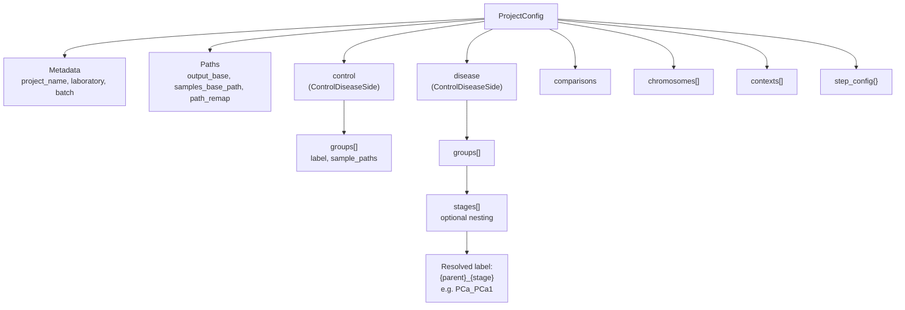

**Control side** (`controls`): one or more groups, e.g. `all` with a CSV of healthy sample paths.

**Disease side** (`diseases`): groups may nest **`stages`** (e.g. Gleason PCa1–PCa4 under parent `PCa`). Resolved centroid labels become `{parent}_{stage}` → `PCa_PCa1`.

### Comparisons

`comparisons` can be:

| Form | Behavior |
|------|----------|
| `"control_vs_each_disease"` | First control group vs **each** resolved disease leaf |
| `"all_pairs"` | Every control leaf × every disease leaf |
| `[{control_group, disease_group, comparison_label?}, …]` | Explicit list |

Detection output paths follow: `detections/{control_group}/{disease_group}/`.

### Example snippet (two-group OvR style)

External reference project (not in repo): `project_PCa3.json` with one control (`all`) and two disease stages (`PCa_Low`, `PCa_High`). In-repo analogue with four stages:

```json
{
  "project_name": "Healthy_vs_PCa1-4-CG",
  "output_base": "/work/prostate-cancer",
  "controls": {
    "label": "healthy",
    "groups": [{ "label": "all", "sample_paths": ["/work/prostate-cancer/data/healthy.csv"] }]
  },
  "diseases": {
    "label": "cancer",
    "groups": [{
      "label": "PCa",
      "stages": [
        { "label": "PCa1", "description": "Gleason Score 3+3", "sample_paths": ["..."] },
        { "label": "PCa2", "description": "Gleason Score 3+4", "sample_paths": ["..."] }
      ]
    }]
  },
  "comparisons": "control_vs_each_disease",
  "chromosomes": ["1", "2", "...", "22", "X", "Y"],
  "contexts": ["CG"],
  "step_config": {
    "centroid": { "base_config": { "use_gpu": true, "min_coverage": 4 } },
    "detection": { "alpha": 0.05 },
    "progression": { "ordered_comparison_labels": ["PCa1", "PCa2", "PCa3", "PCa4"] }
  }
}
```

For a **two-group OvR** study (one control vs two disease stages), use `"comparisons": "control_vs_each_disease"` with two disease leaves (`PCa_Low`, `PCa_High`) — see [Section 5](#5-two-group-example-config--workflow-tree).

---

## 2. JSON Schema hierarchy

Schemas are **JSON Schema draft 2020-12**. The top-level document is generated from Pydantic (`ProjectConfig`) and kept in sync via `methyl-export-config-schemas` ([`packages/methylvalidation/methyl_validation/config_schema_registry.py`](/home/ubuntu/MethylPipeline/packages/methylvalidation/methyl_validation/config_schema_registry.py)).

### Reference tree

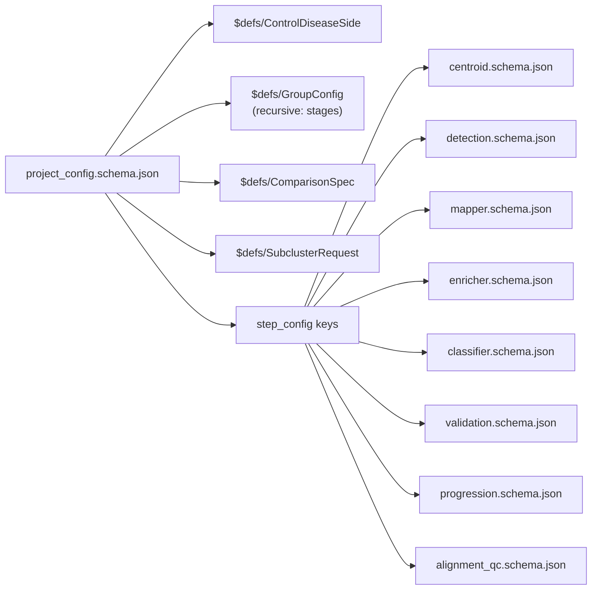

### `$defs` in `project_config.schema.json`

| Definition | Required fields | Purpose |
|--------------|-------------------|---------|
| `ComparisonSpec` | `control_group`, `disease_group` | One pairwise comparison |
| `ControlDiseaseSide` | `label` | Control or disease side with `groups[]` |
| `GroupConfig` | `label` | Cohort or stage; optional `stages[]`, `subcluster`, `level_labels_path` |
| `SubclusterRequest` | (none) | Optional MethylCluster pre-centroid clustering |

### Per-step schemas (`schemas/config/`)

| File | Step |
|------|------|
| `centroid.schema.json` | MethylCentroid |
| `detection.schema.json` | MethylDetector |
| `mapper.schema.json` | MethylMapper |
| `enricher.schema.json` | MethylEnricher |
| `classifier.schema.json` | MethylClassifier |
| `predictor.schema.json` | MethylPredictor |
| `validation.schema.json` | MethylValidation (+ nested `validation_monte_carlo`, `validation_regulatory`, `validation_backend_profiles`, …) |
| `progression.schema.json` | MethylDiseaseProgression |
| `alignment_qc.schema.json` | Alignment QC |

`step_config` in the project file is an open object: keys name the step; values are merged into each tool’s config at runtime (CLI and workers still override with flags/files).

### Constraint enforcement

- **Portal editor:** loads `*.schema.json` and blocks invalid types, missing required fields, and bad enums at edit time ([Section 3](#3-portal-config-editor)).
- **Python runtime:** `ProjectConfig.model_validate()` on `load_project()` enforces the same rules before any pipeline step runs.
- **Comparisons resolution:** `get_comparisons()` in `pipeline_config.py` expands shorthands and validates that `control_group` / `disease_group` labels exist in resolved cohort leaves.

---

## 3. Portal config editor

There is **no separate React/TypeScript portal** in this repository. JSON editing is provided by **methyl-config-editor**: a schema-driven Delphi application with a **web port** suitable for embedding in a company portal.

| Component | Path |
|-----------|------|
| Desktop (VCL) | [`tools/methyl-config-editor/MethylConfigEditor.dproj`](/home/ubuntu/MethylPipeline/tools/methyl-config-editor/MethylConfigEditor.dproj) |
| Web (uniGUI) | [`tools/methyl-config-editor/MethylConfigEditorWeb.dproj`](/home/ubuntu/MethylPipeline/tools/methyl-config-editor/MethylConfigEditorWeb.dproj) — default port **8077** |
| Schema loader | [`src/Schema/JsonSchemaLoader.pas`](/home/ubuntu/MethylPipeline/tools/methyl-config-editor/src/Schema/JsonSchemaLoader.pas) |
| Web property grid | [`src/Web/SchemaPropertyGrid.pas`](/home/ubuntu/MethylPipeline/tools/methyl-config-editor/src/Web/SchemaPropertyGrid.pas) |

### Editor flow

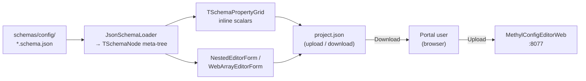

**Behavior:**

1. Administrator points the web app at `schemas/config` (`Paths.SchemasRoot` in `methyl-config-editor-web.ini`).
2. User selects schema **`project_config.schema.json`**, uploads or creates JSON.
3. **Scalars** edit inline in `TUniPropertyGrid`; **objects/arrays** open modal nested editors.
4. `$ref` to sibling files (e.g. `centroid.schema.json`) resolves at load time — no code generation.
5. User downloads validated JSON.

### From project JSON to workflow run

The portal (or a separate **planner service**) maps a validated project config into a **`workflow_instance.context_json`** — runtime variables for the workflow engine, not a copy of the full project file.

Typical mapping:

| Project config | `context_json` |
|----------------|----------------|
| Resolved comparisons | `comparisons[]` with `label`, `centroid2Dir`, `detectOutDir`, … |
| `chromosomes` | `chromosomes[]` |
| `output_base` + paths | `centroid1Dir`, `projectPath`, tool name strings |
| `step_config.progression.ordered_comparison_labels` | `orderedComparisonLabels` |

Example instance payload: [`workflow_engine/sql/instance_context_examples/pca_ovr.json`](/home/ubuntu/MethylPipeline/workflow_engine/sql/instance_context_examples/pca_ovr.json).

Starting a run (middle-tier):

```http
POST /v1/workflows/instances
{ "workflow_version_id": <DataDrivenPipeline version id>, "context_json": { ... } }
```

---

## 4. Workflow database model

The workflow engine stores **definitions** (reusable trees) and **runtime** (instances, executions, leases). The same logical model deploys to **Azure SQL Database** (T-SQL, `json` columns) or **Azure PostgreSQL** (`jsonb`). Stored procedure names are contractually identical ([`workflow_engine/contract/db_objects.yaml`](/home/ubuntu/MethylPipeline/workflow_engine/contract/db_objects.yaml)).

Deploy scripts:

- SQL Server: bundled [`workflow_engine/sql/MethylPipeline.sql`](/home/ubuntu/MethylPipeline/workflow_engine/sql/MethylPipeline.sql) + parity scripts
- PostgreSQL: [`workflow_engine/sql_pg/`](/home/ubuntu/MethylPipeline/workflow_engine/sql_pg/) (`00_schema.sql` … `07_scope_encoding_parity.sql`)

### Tables by layer

| Layer | Tables |
|-------|--------|
| **Definition** | `workflow_def`, `workflow_version`, `workflow_node`, `workflow_edge`, `workflow_action`, `workflow_input_template`, `workflow_input_binding`, `variable_output_binding`, `node_scope_default` |
| **Runtime** | `workflow_instance`, `node_execution`, `task_lease`, `loop_state`, `execution_context`, `scope_variable`, `instance_cursor` |
| **Workers / cluster** | `worker`, `worker_token`, `cluster` |

### Control-flow node types

`workflow_node.node_type` CHECK constraint:

```
ACTION | SEQUENCE | PARALLEL | IF | SWITCH | REPEAT | WHILE | FOREACH
```

| Type | Role |
|------|------|
| `ACTION` | Leaf task; bound to `workflow_action`; becomes `READY` for workers |
| `SEQUENCE` | Run children in `child_order` |
| `PARALLEL` | Run all children concurrently; complete when all succeed |
| `FOREACH` | Iterate a JSON array from `context_json` (`foreach_collection_var`); `foreach_parallel=1` fans out all iterations at once |
| `IF` / `SWITCH` | Branch on scope variable or prior task result |
| `REPEAT` / `WHILE` | Fixed-count or condition loops |

`workflow_edge.branch_kind`: `SEQUENCE`, `PARALLEL`, `THEN`, `ELSE`, `CASE`, `DEFAULT`, `BODY`.

### Entity relationship (simplified)

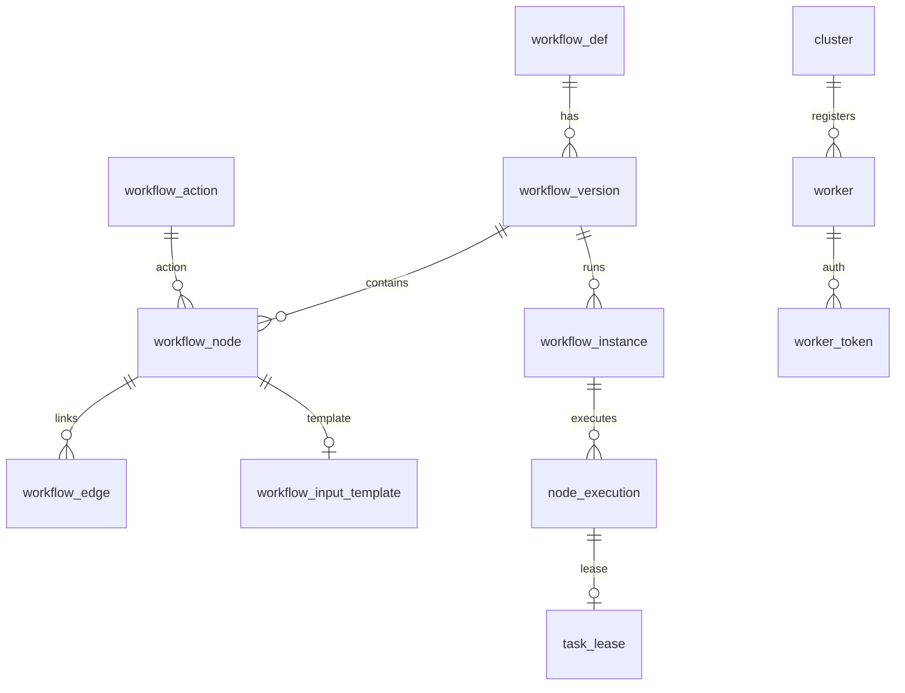

### Scoped variables — declaration, assignment, and use

Scoped variables are a first-class workflow feature: they carry **instance parameters**, **loop indices**, **FOREACH item fields**, and **outputs from prior worker actions** through the execution tree. The engine resolves them when building `input_json` and when choosing IF / SWITCH / WHILE branches.

**Why they exist:**

1. **Complex control flow** — conditions that are too rich for a static workflow definition (QC gates, pagination, model-quality thresholds, custom business rules) can be evaluated inside a worker ACTION; the worker writes an integer or JSON fragment back into scope, and downstream IF / SWITCH / WHILE nodes read that value.
2. **Validation / Monte Carlo iterations** — each iteration needs a **fresh stratified train/validation partition**. A **domain planner** (outside the engine) materializes partition descriptors into `context_json.iterations[]`; FOREACH flattens each element into scope and templates reference `${var.taskConfig}` directly.

#### Storage model

| Object | Layer | Role |
|--------|-------|------|
| `wf.scope_variable` | Runtime | `(workflow_instance_id, scope_node_execution_id, var_name) → value_json` |
| `wf.node_scope_default` | Definition | Variables declared when a composite scope **opens** (`var_name`, `default_expr`) |
| `wf.variable_output_binding` | Definition | Maps ACTION **output** → scope variable (`result_code` or `output_path` into `output_json`) |
| `workflow_node.condition_var` / `switch_var` | Definition | IF / SWITCH / WHILE read these names from scope |

**Scope identity:** `scope_node_execution_id = 0` is the **instance root** (global scope). Each composite node (SEQUENCE, PARALLEL, REPEAT, WHILE, FOREACH, IF, SWITCH) opens a child scope tied to its `node_execution.id`. Lookup walks **up the parent chain** until a name is found (`wf.wf_get_scope_variable_json`).

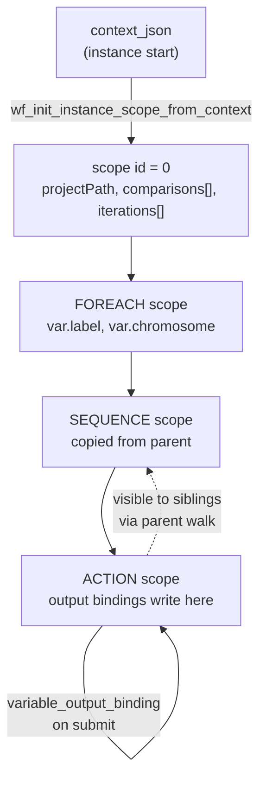

#### Declaration (definition-time)

**`node_scope_default`** declares variables that appear when a node’s scope opens. Values are **expressions**, not literals: the engine resolves `${...}` placeholders against the current scope before assignment.

Example from per-comparison nodes in legacy PCa seeds: `centroid2Dir`, `detectOutDir`, and `comparisonLabel` are seeded as defaults on each comparison subtree so the workflow definition stays generic while paths vary by comparison label.

#### Assignment (runtime)

| Mechanism | When | Example |
|-----------|------|---------|
| Instance bootstrap | `StartInstance` | Every top-level key in `context_json` → scope `0` |
| Scope open | Composite activation | Copy parent scope + apply `node_scope_default` |
| FOREACH iteration | Each loop body activation | Bind `foreach_item_var` fields and flatten object keys (`runId`, `taskConfig`, …) |
| REPEAT / WHILE | Loop body | `${ctx.iterationNo}` in `execution_context` |
| ACTION complete | Worker submit | `variable_output_binding`: `result_code` or JSON path from `output_json` |
| Domain planner (optional) | Before instance start | Populates `context_json.iterations[]`; may audit via `wf.instance_extension` |

Engine write-path: [`wf_sql_scope_writepath_parity.sql`](/home/ubuntu/MethylPipeline/workflow_engine/sql/wf_sql_scope_writepath_parity.sql) (`wf_set_scope_variable`, `wf_open_scope`, `wf_apply_output_bindings`).

#### Use (read-path)

**Input templates and bindings** resolve placeholders at task claim time:

| Token family | Example | Source |
|--------------|---------|--------|
| Scope variable | `${var.chromosome}` | Scope chain walk |
| Indexed array in scope | `${var.orderedComparisonLabels[0]}` | JSON array element |
| FOREACH context | `${ctx.item}`, `${ctx.index}` | Current iteration |
| Loop context | `${ctx.iterationNo}`, `${ctx.parallelIndex}` | `execution_context` |
| Prior task | `${ctx.task.detect.resultCode}` | Latest terminal execution of `detect` |

The resolver does **not** evaluate arithmetic or boolean expressions in placeholders. Any logic beyond simple lookup must run in a worker (or in the planner before the instance starts) and **publish** a scalar or JSON value into scope.

**Control-flow reads:** IF, SWITCH, and WHILE nodes specify `condition_var` / `switch_var`. The engine reads an **integer** from scope (`0` = false / exit loop; non-zero = true / continue). If the variable is absent, it falls back to `condition_ref_node_key` / `switch_ref_node_key` (prior ACTION `result_code`). See [`WORKFLOW_ENGINE_DELPHI.md`](/home/ubuntu/MethylPipeline/workflow_engine/WORKFLOW_ENGINE_DELPHI.md) and [`wf_sql_branch_parity.sql`](/home/ubuntu/MethylPipeline/workflow_engine/sql/wf_sql_branch_parity.sql).

### Worker-driven conditions and branching

For conditions that depend on **data-dependent computation**, the workflow pattern is:

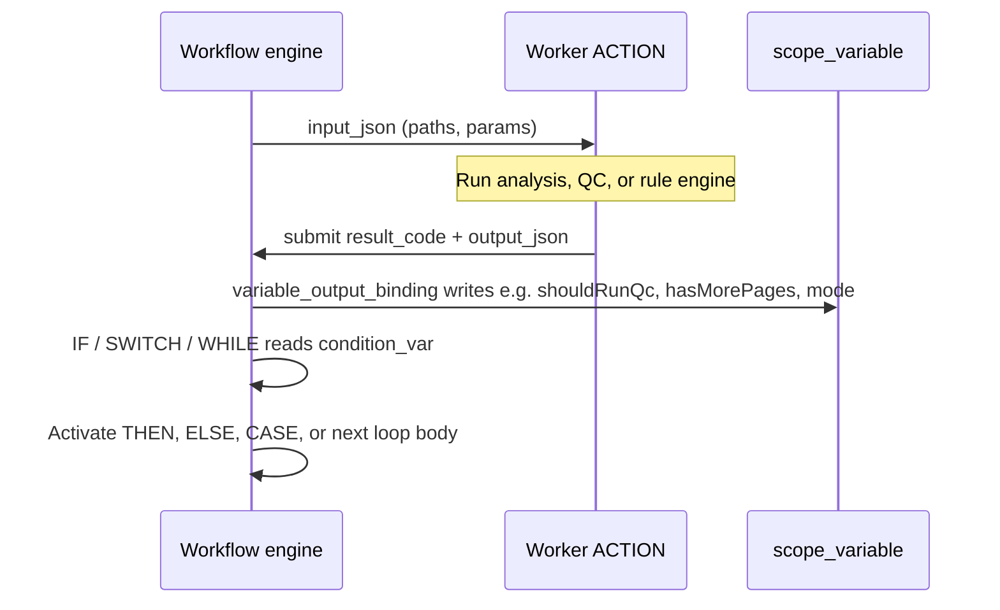

**Example tree** (from Delphi reference seed `DelphiTreeFlow`):

- `GateIf` — `condition_var = shouldRunQc`: worker sets `1` to run QC, `0` to skip.
- `ModeSwitch` — `switch_var = mode`: worker chooses normalization branch (`1`, `2`, or default).
- `PollWhile` — `condition_var = hasMorePages`: pagination worker sets `1` until no pages remain, then `0`.

This keeps the **workflow graph static** while allowing arbitrarily complex predicates inside workers. Bindings can take either:

- **`source_kind = result_code`** — worker returns a signed integer directly.
- **`source_kind = output_path`** — worker returns JSON; engine extracts a field (e.g. `$.gate.passed`) into scope.

### Extension pattern: validation and Monte Carlo

Monte Carlo validation ([`packages/methylvalidation`](/home/ubuntu/MethylPipeline/packages/methylvalidation/)) repeats analysis on many **independent random splits** of the same cohorts. That domain logic stays **outside** the workflow engine core:

| Layer | Responsibility |
|-------|----------------|
| **Engine** | Static graph; `FOREACH` over `context_json.iterations[]`; `${var.taskConfig}` in `workflow_input_template` |
| **Planner worker** | Reads `project.json` / portal validation config; produces `iterations[]` before `sp_start_workflow_instance` |
| **Optional audit** | `wf.instance_extension` keyed e.g. `methylvalidation.plan` (`data_json` json/jsonb) |

Each planner-produced iteration typically:

1. Draws a **stratified partition** per cohort (`train_fraction`, e.g. `0.8`).
2. Materializes a run-specific project under `monte_carlo_runs/run_XXXX/`.
3. Emits an object with `runId`, `phase`, `projectPath`, and opaque `taskConfig` JSON.

Stratified split: [`methyl_validation/split.py`](/home/ubuntu/MethylPipeline/packages/methylvalidation/methyl_validation/split.py). Planner contract: [`contract/validation_planner_capabilities.md`](/home/ubuntu/MethylPipeline/workflow_engine/contract/validation_planner_capabilities.md).

#### Example workflow topology (`ValidationPipeline`)

Seed: [`wf_validation_pipeline_seed.sql`](/home/ubuntu/MethylPipeline/workflow_engine/sql/wf_validation_pipeline_seed.sql)

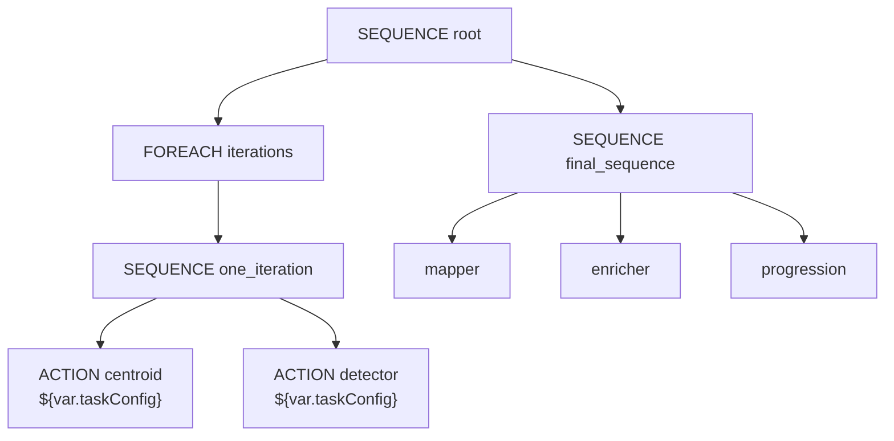

FOREACH flattening copies each `iterations[]` element's fields into scope, so templates embed `taskConfig` without hidden engine injection. The **final sequence** runs mapper → enricher → progression on the base `projectPath` after all iterations complete.

**Composition:** outer `FOREACH iterations` × inner `FOREACH comparisons/chromosomes` (DataDrivenPipeline pattern) — see [`wf_foreach_design.md`](/home/ubuntu/MethylPipeline/workflow_engine/sql/wf_foreach_design.md).

Example `context_json` fragment:

```json
{
  "projectPath": "/work/study/Plasma_healthy_vs_PCa",
  "iterations": [
    {
      "runId": "feature_run_0001",
      "phase": "feature",
      "projectPath": "/work/study/.../monte_carlo_runs/run_0001",
      "taskConfig": { "runId": "feature_run_0001", "phase": "feature", "iteration": 1 }
    }
  ]
}
```

Full example: [`validation_mc.json`](/home/ubuntu/MethylPipeline/workflow_engine/sql/instance_context_examples/validation_mc.json).

Legacy `MethylValidationFlow` + `context_json.monteCarlo` + `wf.monte_carlo_*` tables are **deprecated**. See [`packages/methylvalidation/docs/USAGE.md`](/home/ubuntu/MethylPipeline/packages/methylvalidation/docs/USAGE.md) for CLI/filesystem-first validation.

Project-level MC parameters also live under `step_config.validation` in the portal schema (`validation_monte_carlo` in [`validation.schema.json`](/home/ubuntu/MethylPipeline/schemas/config/validation.schema.json)): `train_fraction`, `n_iterations`, cohort CSVs, and regulatory metadata.

### Cluster metadata in DB

```sql
wf.cluster (
  cluster_key, name, provider,
  shared_storage_uri,    -- e.g. file://share or https://...
  worker_mount_path,     -- default '/work'
  status
)
```

Workers register against a cluster; capabilities are stored on `wf.worker.capabilities` (JSON).

---

## 5. Two-group example: config → workflow tree

This section ties **one control vs two disease groups** (OvR-style) to the **`DataDrivenPipeline`** workflow definition and a concrete `context_json`.

### 5.1 Project intent (PCa3-style)

| Item | Value |
|------|--------|
| Control | `controls.all` |
| Disease stages | e.g. `PCa_Low`, `PCa_High` (two comparisons) |
| Context | `CG` |
| Chromosomes | 24 (`1`–`22`, `X`, `Y`) |
| Comparisons shorthand | `control_vs_each_disease` |

Resolved directories (under `/work/prostate-cancer/PCa3/`):

- Centroids control: `centroids/controls/healthy/all`
- Centroids disease: `centroids/diseases/cancer/{PCa_Low|PCa_High}`
- Detections: `detections/all/{PCa_Low|PCa_High}`

### 5.2 Instance `context_json` (runtime)

From [`workflow_engine/sql/instance_context_examples/pca_ovr.json`](/home/ubuntu/MethylPipeline/workflow_engine/sql/instance_context_examples/pca_ovr.json):

```json
{
  "projectPath": "/home/ubuntu/Work/prostate-cancer/configs/project_PCa3.json",
  "context": "CG",
  "centroid1Dir": "/work/prostate-cancer/PCa3/centroids/controls/healthy/all",
  "group1Label": "group1",
  "orderedComparisonLabels": ["PCa_Low", "PCa_High"],
  "chromosomes": ["1", "2", "...", "22", "X", "Y"],
  "comparisons": [
    {
      "label": "PCa_Low",
      "centroid2Dir": "/work/prostate-cancer/PCa3/centroids/diseases/cancer/PCa_Low",
      "detectOutDir": "/work/prostate-cancer/PCa3/detections/all/PCa_Low",
      "group2Label": "group2"
    },
    {
      "label": "PCa_High",
      "centroid2Dir": "/work/prostate-cancer/PCa3/centroids/diseases/cancer/PCa_High",
      "detectOutDir": "/work/prostate-cancer/PCa3/detections/all/PCa_High",
      "group2Label": "group2"
    }
  ]
}
```

No per-chromosome nodes are stored in the DB — only **~15 static nodes** in `DataDrivenPipeline`; fan-out is entirely data-driven.

### 5.3 Workflow tree (`DataDrivenPipeline`)

Seed: [`workflow_engine/sql/wf_data_driven_pipeline_seed.sql`](/home/ubuntu/MethylPipeline/workflow_engine/sql/wf_data_driven_pipeline_seed.sql)

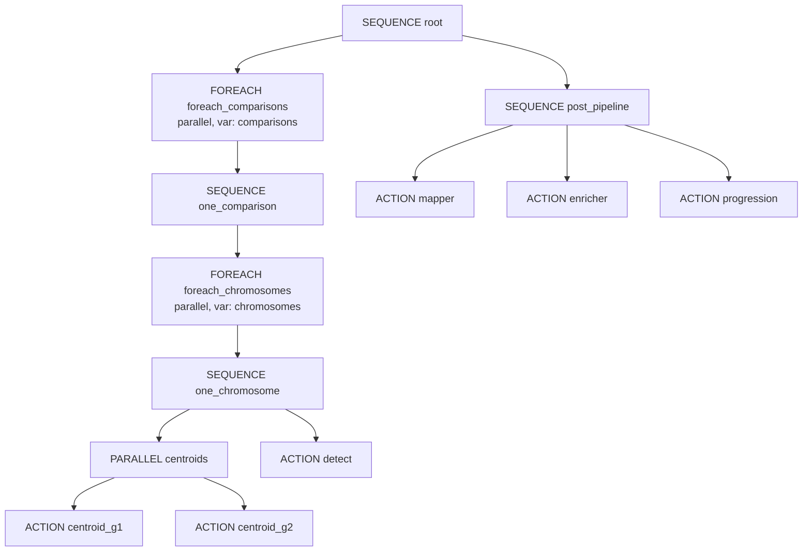

### 5.4 Per-chromosome dependency (one comparison)

```text
one_chromosome (SEQUENCE)
├─ PARALLEL centroids
│  ├─ centroid_g1  (methyl-centroid → centroid1Dir)
│  └─ centroid_g2  (methyl-centroid → centroid2Dir)
└─ detect         (methyl-detector → detectOutDir)
```

`detect` runs only after **both** centroids for that chromosome succeed (PARALLEL parent must complete first).

### 5.5 Execution scale (PCa OvR example)

| Phase | Count |
|-------|------:|
| Comparisons (parallel) | 2 |
| Chromosomes per comparison | 24 |
| Actions per chromosome | 3 (2 centroids + 1 detect) |
| **Subtotal ACTION tasks** | **2 × 24 × 3 = 144** |
| Post-pipeline (sequential) | mapper + enricher + progression = **3** |
| **Total ACTION executions** | **147** |

Post steps run only after **all** comparison branches complete (root `SEQUENCE`: fan-out then post_pipeline).

### 5.6 Input templates (resolved at claim time)

| Node | Resolved `input_json` fields |
|------|---------------------------|
| `centroid_g1` | `project`, `group`, `chromosome`, `context`, `comparison`, `outputDir` → `centroid1Dir` |
| `centroid_g2` | same with `centroid2Dir` |
| `detect` | `project`, `chromosome`, `centroid1Dir`, `centroid2Dir`, `outputDir` |
| `mapper` / `enricher` | `project` only (reads detection outputs from shared storage) |
| `progression` | `project`, `orderedComparisonLabels` |

Worker contracts: [`workflow_engine/sql/wf_worker_contracts_pca_ovr.md`](/home/ubuntu/MethylPipeline/workflow_engine/sql/wf_worker_contracts_pca_ovr.md)

---

## 6. Worker protocol and middle-tier

Workers **never connect to the database directly**. They use the REST API (or an equivalent gateway) documented in [`contracts/openapi.yaml`](/home/ubuntu/MethylPipeline/contracts/openapi.yaml) and [`workflow_engine/WORKER_PROTOCOL.md`](/home/ubuntu/MethylPipeline/workflow_engine/WORKER_PROTOCOL.md).

### REST endpoints

| Method | Path | Caller |
|--------|------|--------|
| `POST` | `/v1/workers/authenticate` | Worker registration |
| `POST` | `/v1/workers/tasks/request` | Worker poll loop |
| `POST` | `/v1/workers/tasks/{id}/submit` | Task completion |
| `POST` | `/v1/workers/tasks/{id}/heartbeat` | Long-running jobs |
| `POST` | `/v1/workers/tasks/{id}/fail` | Explicit failure |
| `POST` | `/v1/workflows/instances` | Portal / admin |
| `GET` | `/v1/workflows/instances/{id}` | Portal status |

Implementation: [`workflow_engine/src/WfEngine.RestApi.pas`](/home/ubuntu/MethylPipeline/workflow_engine/src/WfEngine.RestApi.pas), served by [`WfEngine.RestHttpServer.pas`](/home/ubuntu/MethylPipeline/workflow_engine/src/WfEngine.RestHttpServer.pas) (default port **8080**).

Python gateway (PostgreSQL parity testing): [`workflow_engine/rest/gateway.py`](/home/ubuntu/MethylPipeline/workflow_engine/rest/gateway.py).

### Request / submit sequence

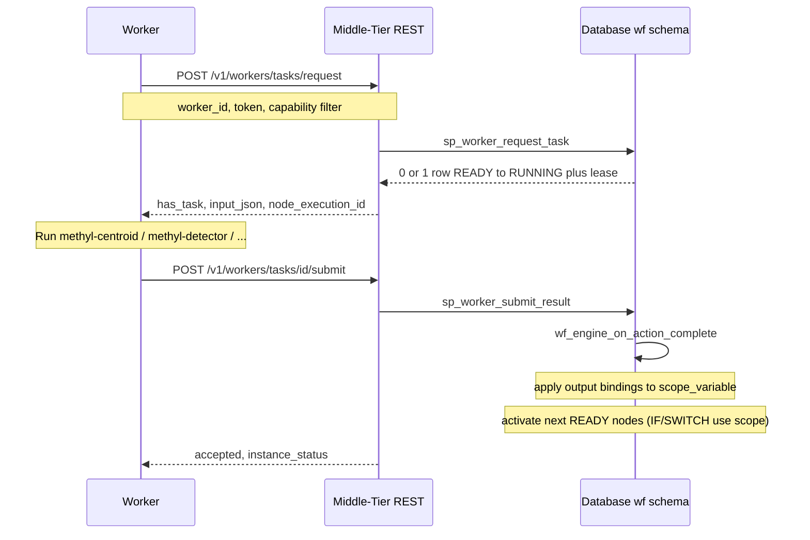

### Middle-tier responsibilities

| Component | Role |
|-----------|------|
| **`WfEngine.RestHttpServer`** | HTTP → `TRestApiService.Handle` |
| **`TRestApiService`** | Auth, JSON parse, call `sp_*` or Delphi engine path |
| **`TWorkflowEngine` / SQL procs** | Activate graph, resolve templates, advance control flow |
| **`TWorkflowEngineHostedService.RunUntilStopped`** | Observability tick only — **does not dispatch tasks** |

**State:** All workflow progress lives in the database (`node_execution.status`, `task_lease`, `scope_variable`). The middle-tier is **stateless** between HTTP calls.

### Capability matching

| `workflow_action` | Capability string | Worker advertises |
|-------------------|-------------------|-------------------|
| `pipeline.centroid` | `methyl-centroid` | `methyl-centroid` |
| `pipeline.detector` | `methyl-detector` | `methyl-detector` |
| `pipeline.mapper` | `methyl-mapper` | `methyl-mapper` |
| `pipeline.enricher` | `methyl-enricher` | `methyl-enricher` |
| `pipeline.progression` | `methyl-disease-progression` | `methyl-disease-progression` |

`sp_worker_request_task` claims the oldest `READY` row matching the worker’s capability (optional filter), using `FOR UPDATE SKIP LOCKED` on PostgreSQL for safe concurrent polling.

---

## 7. Cluster and shared storage model

Distributed processing assumes **all worker nodes see the same filesystem** at a common mount point, conventionally **`/work`**, recorded in `wf.cluster.worker_mount_path` and optionally `shared_storage_uri`.

### Assumptions

1. **Shared storage:** NFS, Azure Files, or equivalent mounted at `/work` on every compute node.
2. **Path contract:** `input_json` carries absolute paths under that mount (`centroid1Dir`, `detectOutDir`, …). Workers read and write files directly; the DB stores paths, not file bytes.
3. **No worker-to-worker RPC:** Dependencies are enforced only by the workflow tree (e.g. `detect` after both centroids for the same chromosome).
4. **Maximize parallelism:** Outer `FOREACH` over comparisons and inner `FOREACH` over chromosomes both use **`foreach_parallel = 1`**, so up to `len(comparisons) × len(chromosomes)` centroid pairs and detections can run concurrently, bounded by worker count.
5. **Serialization within a chromosome:** For each `(comparison, chromosome)`, detect waits for both centroids — the only mandatory per-chromosome barrier.
6. **Post-pipeline barrier:** Mapper, enricher, and progression run only after **all** detection tasks complete (second child of root `SEQUENCE`).

### Architecture diagram

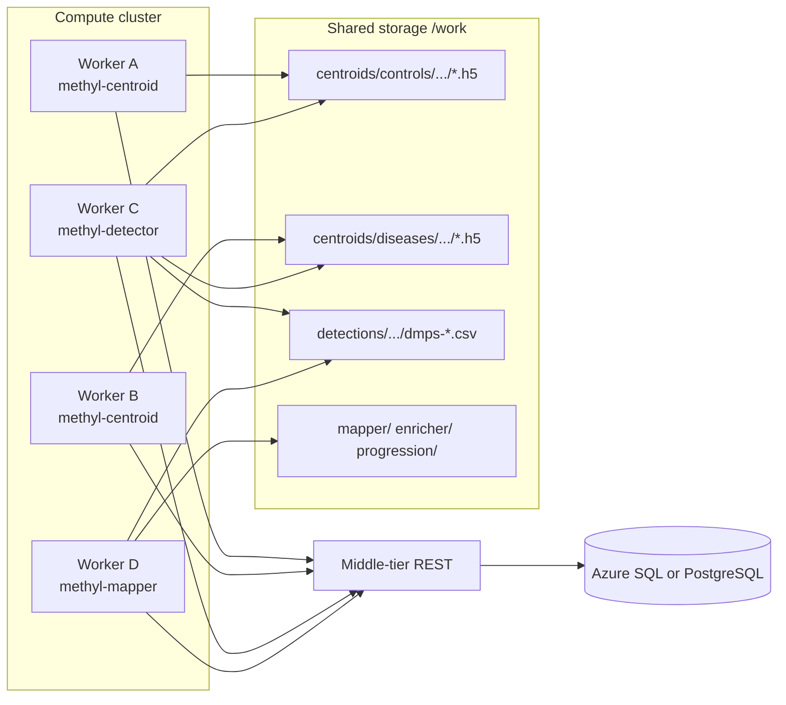

### Minimizing total processing time

| Technique | Effect |
|-----------|--------|
| Per-chromosome parallelism | 24 chromosomes per comparison run concurrently |
| Per-comparison parallelism | Multiple disease groups run concurrently |
| Capability-specific workers | Centroid-heavy and detector-heavy nodes scale independently |
| `SKIP LOCKED` task claim | Many workers poll without blocking each other |
| Shared output paths | Centroid output for chr *N* is input to detect for chr *N* on the same mount — no data shipping between nodes |

### Portal + planner + engine (end-to-end)

```text
1. User edits project.json in portal (schema-validated)
2. Planner builds context_json (comparisons[], chromosomes[], dirs)
3. Portal POST /v1/workflows/instances { workflow_version_id, context_json }
4. Engine activates DataDrivenPipeline → thousands of READY rows materialized logically
5. Workers on cluster pull tasks, read/write /work/..., submit results
6. Instance status → COMPLETED when root SEQUENCE finishes
```

---

## Further reading

| Document | Topic |
|----------|--------|
| [`workflow_engine/sql/DataDrivenPipeline.md`](/home/ubuntu/MethylPipeline/workflow_engine/sql/DataDrivenPipeline.md) | FOREACH workflow, deploy order |
| [`workflow_engine/WORKFLOW_ENGINE_DELPHI.md`](/home/ubuntu/MethylPipeline/workflow_engine/WORKFLOW_ENGINE_DELPHI.md) | Scope variables, IF/SWITCH/WHILE, Monte Carlo bridge |
| [`workflow_engine/CAPABILITY_CHECK.md`](/home/ubuntu/MethylPipeline/workflow_engine/CAPABILITY_CHECK.md) | Engine capabilities vs gaps |
| [`docs/theory/chapters/05-methylpredictor-and-validation.qmd`](/home/ubuntu/MethylPipeline/docs/theory/chapters/05-methylpredictor-and-validation.qmd) | Theory: Monte Carlo splits and validation |
| [`docs/theory/chapters/11-project-configuration.qmd`](/home/ubuntu/MethylPipeline/docs/theory/chapters/11-project-configuration.qmd) | Theory: project configuration |
| [`tools/methyl-config-editor/README.md`](/home/ubuntu/MethylPipeline/tools/methyl-config-editor/README.md) | Config editor setup |
| [`workflow_engine/README.md`](/home/ubuntu/MethylPipeline/workflow_engine/README.md) | SQL deploy order |

---

*Document version: aligns with `DataDrivenPipeline` seed, `FOREACH` engine support, scoped-variable write-path parity, and Monte Carlo plan/run tables.*
