Presentation-oriented overview of how a **project configuration** (JSON), a **schema-validated portal editor**, a **workflow database** (including **scoped variables**), a **stateless middle-tier**, and **remote workers** cooperate to run a configurable methylation pipeline on a shared-storage cluster.

**Audience:** engineers and stakeholders reviewing the company portal, backend database, middle-tier, and compute workers.

**Related code:** [`schemas/config/`](/home/ubuntu/MethylPipeline/schemas/config/), [`tools/methyl-config-editor/`](/home/ubuntu/MethylPipeline/tools/methyl-config-editor/), [`workflow_engine/`](/home/ubuntu/MethylPipeline/workflow_engine/)

**Other formats (HTML / PDF):** Quarto source is [`pipeline_architecture.qmd`](pipeline_architecture.qmd), generated from this file.

**Local HTML (diagrams need a live preview server — do not open `pipeline_architecture.html` directly in the browser or in the IDE preview):**

```bash
python workflow_engine/docs/build_pipeline_architecture_qmd.py
quarto preview workflow_engine/docs/pipeline_architecture.qmd
```

Quarto serves the page at `http://localhost:…` and Mermaid renders in your normal browser. See [Rendering](#rendering-this-document) at the end of the `.qmd` for PDF commands.

---

## Presentation map (four layers)

::: {.content-visible when-format="html"}
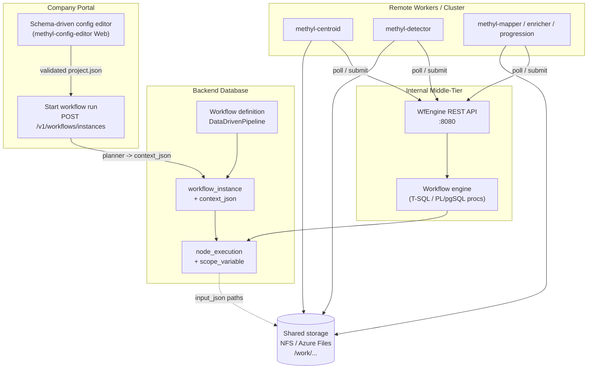
:::

::: {.content-visible when-format="pdf"}
```{=latex}
\begin{figure}[htbp]
\centering
\begin{adjustbox}{max width=\linewidth,center}
\begin{tikzpicture}[node distance=0.65cm and 0.55cm,
  every node/.style={transform shape},
  base/.style={draw, rounded corners=3pt, align=center, font=\footnotesize, minimum height=0.72cm, text width=2.6cm},
  arr/.style={-{Latex[length=2mm]}, thick},
  darr/.style={arr, dashed}]
\node[base, fill=blue!10] (editor) {Schema config editor\\(Web :8077)};
\node[base, fill=blue!10, right=1.1cm of editor] (run) {Start workflow\\POST /instances};
\node[draw, dashed, rounded corners=4pt, inner sep=0.35cm, fill=blue!6, fit=(editor)(run), label={[font=\small\bfseries]above:Company Portal}] (portalbox) {};
\node[base, fill=green!10, below=1.35cm of editor] (wfdef) {DataDrivenPipeline\\definition};
\node[base, fill=green!10, right=0.55cm of wfdef] (inst) {workflow\_instance\\context\_json};
\node[base, fill=green!10, right=0.55cm of inst] (nexec) {node\_execution\\scope\_variable};
\node[draw, dashed, rounded corners=4pt, inner sep=0.35cm, fill=green!6, fit=(wfdef)(inst)(nexec), label={[font=\small\bfseries]above:Backend Database}] (dbbox) {};
\node[base, fill=orange!12, below=1.35cm of wfdef] (rest) {WfEngine REST\\:8080};
\node[base, fill=orange!12, right=0.75cm of rest] (engine) {Engine procs\\T-SQL / PL/pgSQL};
\node[draw, dashed, rounded corners=4pt, inner sep=0.35cm, fill=orange!8, fit=(rest)(engine), label={[font=\small\bfseries]above:Middle-Tier}] (mtbox) {};
\node[base, fill=purple!10, below=1.25cm of rest] (w1) {methyl-centroid};
\node[base, fill=purple!10, right=0.4cm of w1] (w2) {methyl-detector};
\node[base, fill=purple!10, right=0.4cm of w2] (w3) {mapper / enricher / prog.};
\node[draw, dashed, rounded corners=4pt, inner sep=0.35cm, fill=purple!6, fit=(w1)(w2)(w3), label={[font=\small\bfseries]above:Remote Workers}] (wbox) {};
\node[base, fill=gray!12, right=1.6cm of inst] (stor) {Shared storage\\NFS / Azure Files\\/work/...};
\draw[arr] (editor)--node[above, font=\scriptsize]{project.json}(run);
\draw[arr] (run)--(inst);
\draw[arr] (wfdef)--(inst);
\draw[arr] (inst)--(nexec);
\draw[arr] (rest)--(engine);
\draw[arr] (engine)--(nexec);
\draw[arr] (w1)--(rest); \draw[arr] (w2)--(rest); \draw[arr] (w3)--(rest);
\draw[arr] (w1)--(stor); \draw[arr] (w2)--(stor); \draw[arr] (w3)--(stor);
\draw[darr] (nexec)--node[above, font=\scriptsize]{input paths}(stor);
\end{tikzpicture}
\end{adjustbox}
\caption{Four-layer architecture: portal, database, middle-tier, and cluster workers.}
\end{figure}
```
:::


| Layer | Technology | Responsibility |
|-------|------------|----------------|
| Portal | uniGUI web app (`MethylConfigEditorWeb`) | Edit `project.json` against JSON Schema; start runs |
| Database | Azure SQL or Azure PostgreSQL (`wf` schema) | Store workflow tree, instances, executions, leases |
| Middle-tier | Delphi `WfEngine` + REST (`/v1/*`) | Stateless HTTP proxy; invokes engine stored procedures |
| Workers | Python/CLI on cluster nodes | Poll tasks by capability; read/write shared paths |

---

## 1. Project configuration

A **project config** is a single JSON file that describes *what* to run: cohorts, comparisons, chromosomes, contexts, and per-step tool parameters. It is the scientific contract for one methylation study.

**Canonical schema:** [`schemas/config/project_config.schema.json`](/home/ubuntu/MethylPipeline/schemas/config/project_config.schema.json)  
**Pydantic model:** [`packages/methylutils/methyl_utils/pipeline_config.py`](/home/ubuntu/MethylPipeline/packages/methylutils/methyl_utils/pipeline_config.py)  
**In-repo examples:** [`tools/methyl-config-editor/configs/`](/home/ubuntu/MethylPipeline/tools/methyl-config-editor/configs/)

### Top-level structure

Only **`project_name`** and **`output_base`** are required. Everything else is optional and validated by schema.

| Field | Role |
|-------|------|
| `project_name` | Identifier; output lives under `{output_base}/{project_name}/` |
| `output_base` | Global output root (e.g. `/work/prostate-cancer`) |
| `controls` / `disease` | Two-sided layout: control vs disease cohorts |
| `comparisons` | Shorthand string or explicit list of control vs disease pairs |
| `chromosomes` | Shared list (`"1"`…`"22"`, `"X"`, `"Y"`) |
| `contexts` | Methylation contexts: `CG`, `CHG`, `CHH` |
| `path_remap` | Prefix replacement when sample paths moved (e.g. NAS → cluster mount) |
| `step_config` | Per-step overrides: `centroid`, `detection`, `mapper`, `enricher`, `classifier`, `predictor`, `validation`, `progression`, … |

### Cohort hierarchy

::: {.content-visible when-format="html"}
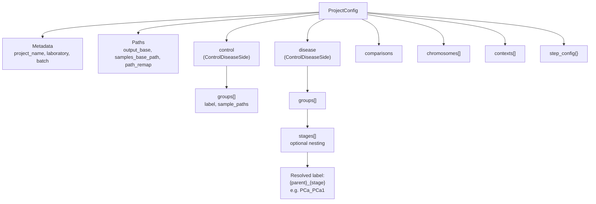
:::

::: {.content-visible when-format="pdf"}
```{=latex}
\begin{figure}[htbp]
\centering
\begin{adjustbox}{max width=\linewidth,center}
\begin{tikzpicture}[node distance=0.65cm and 0.55cm,
  every node/.style={transform shape},
  base/.style={draw, rounded corners=3pt, align=center, font=\footnotesize, minimum height=0.72cm, text width=2.6cm},
  arr/.style={-{Latex[length=2mm]}, thick},
  darr/.style={arr, dashed}]
\node[base, fill=gray!10] (root) {ProjectConfig};
\node[base, below=of root] (meta) {Metadata and paths};
\node[base, below left=0.7cm and 0.3cm of meta] (ctrl) {control side};
\node[base, below right=0.7cm and 0.3cm of meta] (dis) {disease side};
\node[base, below=of meta] (cmp) {comparisons};
\node[base, left=0.5cm of cmp] (chr) {chromosomes};
\node[base, right=0.5cm of cmp] (sc) {step\_config};
\node[base, below=of ctrl] (g1) {groups[]};
\node[base, below=of dis] (g2) {groups[]};
\node[base, below=of g2] (st) {stages[] (optional)};
\draw[arr] (root)--(meta);
\draw[arr] (meta)--(ctrl); \draw[arr] (meta)--(dis);
\draw[arr] (meta)--(cmp); \draw[arr] (meta)--(chr); \draw[arr] (meta)--(sc);
\draw[arr] (ctrl)--(g1); \draw[arr] (dis)--(g2); \draw[arr] (g2)--(st);
\end{tikzpicture}
\end{adjustbox}
\caption{Project configuration JSON hierarchy.}
\end{figure}
```
:::


**Control side** (`controls`): one or more groups, e.g. `all` with a CSV of healthy sample paths.

**Disease side** (`diseases`): groups may nest **`stages`** (e.g. Gleason PCa1–PCa4 under parent `PCa`). Resolved centroid labels become `{parent}_{stage}` → `PCa_PCa1`.

### Comparisons

`comparisons` can be:

| Form | Behavior |
|------|----------|
| `"control_vs_each_disease"` | First control group vs **each** resolved disease leaf |
| `"all_pairs"` | Every control leaf × every disease leaf |
| `[{control_group, disease_group, comparison_label?}, …]` | Explicit list |

Detection output paths follow: `detections/{control_group}/{disease_group}/`.

### Example snippet (two-group OvR style)

External reference project (not in repo): `project_PCa3.json` with one control (`all`) and two disease stages (`PCa_Low`, `PCa_High`). In-repo analogue with four stages:

```json
{
  "project_name": "Healthy_vs_PCa1-4-CG",
  "output_base": "/work/prostate-cancer",
  "controls": {
    "label": "healthy",
    "groups": [{ "label": "all", "sample_paths": ["/work/prostate-cancer/data/healthy.csv"] }]
  },
  "diseases": {
    "label": "cancer",
    "groups": [{
      "label": "PCa",
      "stages": [
        { "label": "PCa1", "description": "Gleason Score 3+3", "sample_paths": ["..."] },
        { "label": "PCa2", "description": "Gleason Score 3+4", "sample_paths": ["..."] }
      ]
    }]
  },
  "comparisons": "control_vs_each_disease",
  "chromosomes": ["1", "2", "...", "22", "X", "Y"],
  "contexts": ["CG"],
  "step_config": {
    "centroid": { "base_config": { "use_gpu": true, "min_coverage": 4 } },
    "detection": { "alpha": 0.05 },
    "progression": { "ordered_comparison_labels": ["PCa1", "PCa2", "PCa3", "PCa4"] }
  }
}
```

For a **two-group OvR** study (one control vs two disease stages), use `"comparisons": "control_vs_each_disease"` with two disease leaves (`PCa_Low`, `PCa_High`) — see [Section 5](#5-two-group-example-config--workflow-tree).

---

## 2. JSON Schema hierarchy

Schemas are **JSON Schema draft 2020-12**. The top-level document is generated from Pydantic (`ProjectConfig`) and kept in sync via `methyl-export-config-schemas` ([`packages/methylvalidation/methyl_validation/config_schema_registry.py`](/home/ubuntu/MethylPipeline/packages/methylvalidation/methyl_validation/config_schema_registry.py)).

### Reference tree

::: {.content-visible when-format="html"}
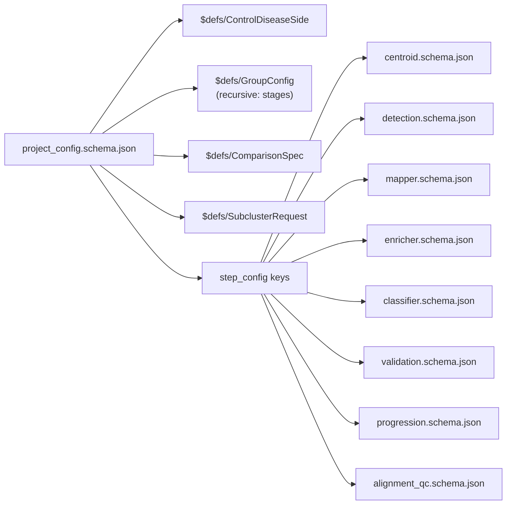
:::

::: {.content-visible when-format="pdf"}
```{=latex}
\begin{figure}[htbp]
\centering
\begin{adjustbox}{max width=\linewidth,center}
\begin{tikzpicture}[node distance=0.65cm and 0.55cm,
  every node/.style={transform shape},
  base/.style={draw, rounded corners=3pt, align=center, font=\footnotesize, minimum height=0.72cm, text width=2.6cm},
  arr/.style={-{Latex[length=2mm]}, thick},
  darr/.style={arr, dashed}]
\node[base, fill=gray!10] (pcs) {project\_config.schema.json};
\node[base, right=1.0cm of pcs] (cds) {\$defs: ControlDiseaseSide};
\node[base, above=0.45cm of cds] (gc) {\$defs: GroupConfig};
\node[base, below=0.45cm of cds] (cs) {\$defs: ComparisonSpec};
\node[base, right=1.0cm of cds] (sc) {step\_config keys};
\node[base, above=0.35cm of sc] (cent) {centroid.schema};
\node[base] at (sc |- cs) (det) {detection.schema};
\node[base, below=0.35cm of sc] (map) {mapper.schema};
\draw[arr] (pcs)--(cds); \draw[arr] (pcs)--(gc); \draw[arr] (pcs)--(cs);
\draw[arr] (pcs)--(sc);
\draw[arr] (sc)--(cent); \draw[arr] (sc)--(det); \draw[arr] (sc)--(map);
\end{tikzpicture}
\end{adjustbox}
\caption{JSON Schema reference tree (excerpt).}
\end{figure}
```
:::


### `$defs` in `project_config.schema.json`

| Definition | Required fields | Purpose |
|--------------|-------------------|---------|
| `ComparisonSpec` | `control_group`, `disease_group` | One pairwise comparison |
| `ControlDiseaseSide` | `label` | Control or disease side with `groups[]` |
| `GroupConfig` | `label` | Cohort or stage; optional `stages[]`, `subcluster`, `level_labels_path` |
| `SubclusterRequest` | (none) | Optional MethylCluster pre-centroid clustering |

### Per-step schemas (`schemas/config/`)

| File | Step |
|------|------|
| `centroid.schema.json` | MethylCentroid |
| `detection.schema.json` | MethylDetector |
| `mapper.schema.json` | MethylMapper |
| `enricher.schema.json` | MethylEnricher |
| `classifier.schema.json` | MethylClassifier |
| `predictor.schema.json` | MethylPredictor |
| `validation.schema.json` | MethylValidation (+ nested `validation_monte_carlo`, `validation_regulatory`, `validation_backend_profiles`, …) |
| `progression.schema.json` | MethylDiseaseProgression |
| `alignment_qc.schema.json` | Alignment QC |

`step_config` in the project file is an open object: keys name the step; values are merged into each tool’s config at runtime (CLI and workers still override with flags/files).

### Constraint enforcement

- **Portal editor:** loads `*.schema.json` and blocks invalid types, missing required fields, and bad enums at edit time ([Section 3](#3-portal-config-editor)).
- **Python runtime:** `ProjectConfig.model_validate()` on `load_project()` enforces the same rules before any pipeline step runs.
- **Comparisons resolution:** `get_comparisons()` in `pipeline_config.py` expands shorthands and validates that `control_group` / `disease_group` labels exist in resolved cohort leaves.

---

## 3. Portal config editor

There is **no separate React/TypeScript portal** in this repository. JSON editing is provided by **methyl-config-editor**: a schema-driven Delphi application with a **web port** suitable for embedding in a company portal.

| Component | Path |
|-----------|------|
| Desktop (VCL) | [`tools/methyl-config-editor/MethylConfigEditor.dproj`](/home/ubuntu/MethylPipeline/tools/methyl-config-editor/MethylConfigEditor.dproj) |
| Web (uniGUI) | [`tools/methyl-config-editor/MethylConfigEditorWeb.dproj`](/home/ubuntu/MethylPipeline/tools/methyl-config-editor/MethylConfigEditorWeb.dproj) — default port **8077** |
| Schema loader | [`src/Schema/JsonSchemaLoader.pas`](/home/ubuntu/MethylPipeline/tools/methyl-config-editor/src/Schema/JsonSchemaLoader.pas) |
| Web property grid | [`src/Web/SchemaPropertyGrid.pas`](/home/ubuntu/MethylPipeline/tools/methyl-config-editor/src/Web/SchemaPropertyGrid.pas) |

### Editor flow

::: {.content-visible when-format="html"}
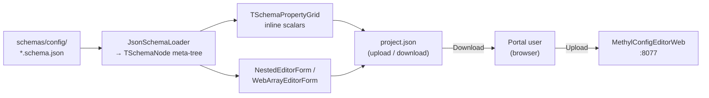
:::

::: {.content-visible when-format="pdf"}
```{=latex}
\begin{figure}[htbp]
\centering
\begin{adjustbox}{max width=\linewidth,center}
\begin{tikzpicture}[node distance=0.65cm and 0.55cm,
  every node/.style={transform shape},
  base/.style={draw, rounded corners=3pt, align=center, font=\footnotesize, minimum height=0.72cm, text width=2.6cm},
  arr/.style={-{Latex[length=2mm]}, thick},
  darr/.style={arr, dashed}]
\node[base] (user) {Portal user\\(browser)};
\node[base, right=1.0cm of user] (web) {MethylConfigEditorWeb\\:8077};
\node[base, above=0.75cm of web] (schemas) {schemas/config/*.schema.json};
\node[base, left=0.75cm of schemas] (loader) {JsonSchemaLoader};
\node[base, right=0.75cm of schemas] (grid) {Property grid /\\nested editors};
\node[base, below=0.85cm of web] (json) {project.json\\upload / download};
\draw[arr] (user)--node[above, font=\scriptsize]{upload}(web);
\draw[arr] (schemas)--(loader); \draw[arr] (loader)--(grid);
\draw[arr] (grid)--(json);
\draw[arr] (json)--node[below, font=\scriptsize]{download}(user);
\end{tikzpicture}
\end{adjustbox}
\caption{Schema-driven portal config editor flow.}
\end{figure}
```
:::


**Behavior:**

1. Administrator points the web app at `schemas/config` (`Paths.SchemasRoot` in `methyl-config-editor-web.ini`).
2. User selects schema **`project_config.schema.json`**, uploads or creates JSON.
3. **Scalars** edit inline in `TUniPropertyGrid`; **objects/arrays** open modal nested editors.
4. `$ref` to sibling files (e.g. `centroid.schema.json`) resolves at load time — no code generation.
5. User downloads validated JSON.

### From project JSON to workflow run

The portal (or a separate **planner service**) maps a validated project config into a **`workflow_instance.context_json`** — runtime variables for the workflow engine, not a copy of the full project file.

Typical mapping:

| Project config | `context_json` |
|----------------|----------------|
| Resolved comparisons | `comparisons[]` with `label`, `centroid2Dir`, `detectOutDir`, … |
| `chromosomes` | `chromosomes[]` |
| `output_base` + paths | `centroid1Dir`, `projectPath`, tool name strings |
| `step_config.progression.ordered_comparison_labels` | `orderedComparisonLabels` |

Example instance payload: [`workflow_engine/sql/instance_context_examples/pca_ovr.json`](/home/ubuntu/MethylPipeline/workflow_engine/sql/instance_context_examples/pca_ovr.json).

Starting a run (middle-tier):

```http
POST /v1/workflows/instances
{ "workflow_version_id": <DataDrivenPipeline version id>, "context_json": { ... } }
```

---

## 4. Workflow database model

The workflow engine stores **definitions** (reusable trees) and **runtime** (instances, executions, leases). The same logical model deploys to **Azure SQL Database** (T-SQL, `json` columns) or **Azure PostgreSQL** (`jsonb`). Stored procedure names are contractually identical ([`workflow_engine/contract/db_objects.yaml`](/home/ubuntu/MethylPipeline/workflow_engine/contract/db_objects.yaml)).

Deploy scripts:

- SQL Server: bundled [`workflow_engine/sql/MethylPipeline.sql`](/home/ubuntu/MethylPipeline/workflow_engine/sql/MethylPipeline.sql) + parity scripts
- PostgreSQL: [`workflow_engine/sql_pg/`](/home/ubuntu/MethylPipeline/workflow_engine/sql_pg/) (`00_schema.sql` … `07_scope_encoding_parity.sql`)

### Tables by layer

| Layer | Tables |
|-------|--------|
| **Definition** | `workflow_def`, `workflow_version`, `workflow_node`, `workflow_edge`, `workflow_action`, `workflow_input_template`, `workflow_input_binding`, `variable_output_binding`, `node_scope_default` |
| **Runtime** | `workflow_instance`, `node_execution`, `task_lease`, `loop_state`, `execution_context`, `scope_variable`, `instance_cursor` |
| **Workers / cluster** | `worker`, `worker_token`, `cluster` |

### Control-flow node types

`workflow_node.node_type` CHECK constraint:

```
ACTION | SEQUENCE | PARALLEL | IF | SWITCH | REPEAT | WHILE | FOREACH
```

| Type | Role |
|------|------|
| `ACTION` | Leaf task; bound to `workflow_action`; becomes `READY` for workers |
| `SEQUENCE` | Run children in `child_order` |
| `PARALLEL` | Run all children concurrently; complete when all succeed |
| `FOREACH` | Iterate a JSON array from `context_json` (`foreach_collection_var`); `foreach_parallel=1` fans out all iterations at once |
| `IF` / `SWITCH` | Branch on scope variable or prior task result |
| `REPEAT` / `WHILE` | Fixed-count or condition loops |

`workflow_edge.branch_kind`: `SEQUENCE`, `PARALLEL`, `THEN`, `ELSE`, `CASE`, `DEFAULT`, `BODY`.

### Entity relationship (simplified)

::: {.content-visible when-format="html"}
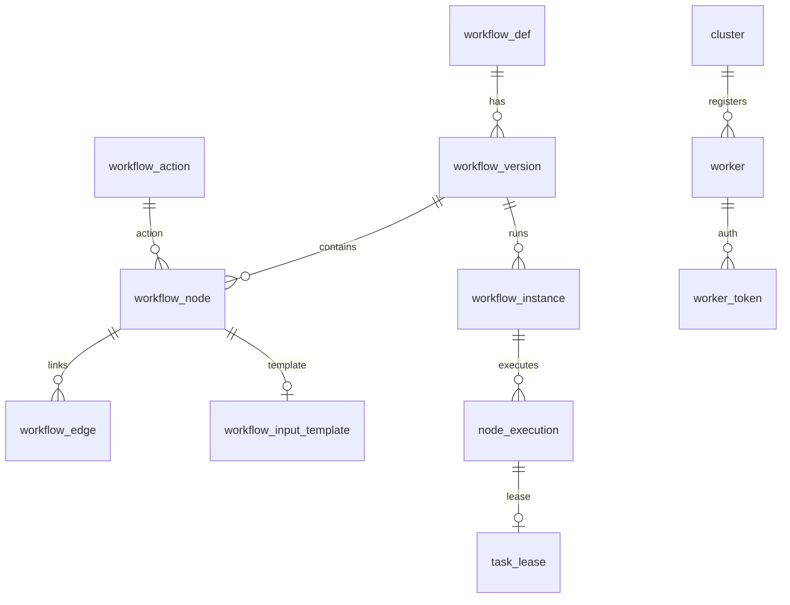
:::

::: {.content-visible when-format="pdf"}
```{=latex}
\begin{figure}[htbp]
\centering
\small
\begin{tabular}{@{}>{\raggedright\arraybackslash}p{0.42\linewidth} p{0.5\linewidth}@{}}
\toprule
\textbf{Entity} & \textbf{Relationships} \\
\midrule
workflow\_def & 1--* workflow\_version \\
workflow\_version & 1--* workflow\_node; 1--* workflow\_instance \\
workflow\_node & *--* workflow\_edge; 0..1 input template \\
workflow\_instance & 1--* node\_execution \\
node\_execution & 0..1 task\_lease; scope via scope\_variable \\
cluster & 1--* worker $\rightarrow$ worker\_token \\
\bottomrule
\end{tabular}
\caption{Workflow database entity relationships (simplified).}
\end{figure}
```
:::


### Scoped variables — declaration, assignment, and use

Scoped variables are a first-class workflow feature: they carry **instance parameters**, **loop indices**, **FOREACH item fields**, and **outputs from prior worker actions** through the execution tree. The engine resolves them when building `input_json` and when choosing IF / SWITCH / WHILE branches.

**Why they exist:**

1. **Complex control flow** — conditions that are too rich for a static workflow definition (QC gates, pagination, model-quality thresholds, custom business rules) can be evaluated inside a worker ACTION; the worker writes an integer or JSON fragment back into scope, and downstream IF / SWITCH / WHILE nodes read that value.
2. **Monte Carlo validation** — each iteration needs a **fresh stratified train/validation partition** of cohort samples (e.g. 80% train / 20% test per cohort). Those partition descriptors are stored as scoped variables (`mc.taskConfig`) and injected into every pipeline step for that iteration.

#### Storage model

| Object | Layer | Role |
|--------|-------|------|
| `wf.scope_variable` | Runtime | `(workflow_instance_id, scope_node_execution_id, var_name) → value_json` |
| `wf.node_scope_default` | Definition | Variables declared when a composite scope **opens** (`var_name`, `default_expr`) |
| `wf.variable_output_binding` | Definition | Maps ACTION **output** → scope variable (`result_code` or `output_path` into `output_json`) |
| `workflow_node.condition_var` / `switch_var` | Definition | IF / SWITCH / WHILE read these names from scope |

**Scope identity:** `scope_node_execution_id = 0` is the **instance root** (global scope). Each composite node (SEQUENCE, PARALLEL, REPEAT, WHILE, FOREACH, IF, SWITCH) opens a child scope tied to its `node_execution.id`. Lookup walks **up the parent chain** until a name is found (`wf.wf_get_scope_variable_json`).

::: {.content-visible when-format="html"}
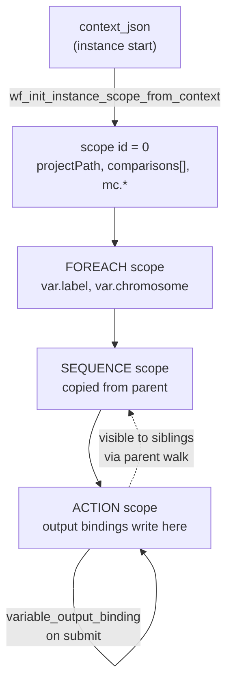
:::

::: {.content-visible when-format="pdf"}
```{=latex}
\begin{figure}[htbp]
\centering
\begin{adjustbox}{max width=\linewidth,center}
\begin{tikzpicture}[node distance=0.65cm and 0.55cm,
  every node/.style={transform shape},
  base/.style={draw, rounded corners=3pt, align=center, font=\footnotesize, minimum height=0.72cm, text width=2.6cm},
  arr/.style={-{Latex[length=2mm]}, thick},
  darr/.style={arr, dashed}]
\node[base] (ctx) {context\_json\\(instance start)};
\node[base, below=of ctx] (root) {scope id = 0\\global variables};
\node[base, below=of root] (fecp) {FOREACH scope\\item fields bound};
\node[base, below=of fecp] (seq) {SEQUENCE scope\\copied from parent};
\node[base, below=of seq] (act) {ACTION scope\\output bindings};
\draw[arr] (ctx)--node[right, font=\scriptsize]{init scope}(root);
\draw[arr] (root)--(fecp); \draw[arr] (fecp)--(seq); \draw[arr] (seq)--(act);
\draw[arr, looseness=5] (act) to[bend left=40] node[right, font=\scriptsize]{on submit}(act);
\draw[darr] (act) to[bend right=30] node[left, font=\scriptsize]{parent walk}(seq);
\end{tikzpicture}
\end{adjustbox}
\caption{Scoped variable hierarchy along the execution tree.}
\end{figure}
```
:::


#### Declaration (definition-time)

**`node_scope_default`** declares variables that appear when a node’s scope opens. Values are **expressions**, not literals: the engine resolves `${...}` placeholders against the current scope before assignment.

Example from per-comparison nodes in legacy PCa seeds: `centroid2Dir`, `detectOutDir`, and `comparisonLabel` are seeded as defaults on each comparison subtree so the workflow definition stays generic while paths vary by comparison label.

#### Assignment (runtime)

| Mechanism | When | Example |
|-----------|------|---------|
| Instance bootstrap | `StartInstance` | Every top-level key in `context_json` → scope `0` |
| Scope open | Composite activation | Copy parent scope + apply `node_scope_default` |
| FOREACH iteration | Each loop body activation | Bind `foreach_item_var` fields (`label`, `chromosome`, …) and `foreach_index_var` |
| REPEAT / WHILE | Loop body | `${ctx.iterationNo}` in `execution_context` |
| ACTION complete | Worker submit | `variable_output_binding`: `result_code` or JSON path from `output_json` |
| Monte Carlo planner | Instance start / iteration | `mc.taskConfig`, `mc.runId`, `mc.phase`, … |

Engine write-path: [`wf_sql_scope_writepath_parity.sql`](/home/ubuntu/MethylPipeline/workflow_engine/sql/wf_sql_scope_writepath_parity.sql) (`wf_set_scope_variable`, `wf_open_scope`, `wf_apply_output_bindings`).

#### Use (read-path)

**Input templates and bindings** resolve placeholders at task claim time:

| Token family | Example | Source |
|--------------|---------|--------|
| Scope variable | `${var.chromosome}` | Scope chain walk |
| Indexed array in scope | `${var.orderedComparisonLabels[0]}` | JSON array element |
| FOREACH context | `${ctx.item}`, `${ctx.index}` | Current iteration |
| Loop context | `${ctx.iterationNo}`, `${ctx.parallelIndex}` | `execution_context` |
| Prior task | `${ctx.task.detect.resultCode}` | Latest terminal execution of `detect` |

The resolver does **not** evaluate arithmetic or boolean expressions in placeholders. Any logic beyond simple lookup must run in a worker (or in the planner before the instance starts) and **publish** a scalar or JSON value into scope.

**Control-flow reads:** IF, SWITCH, and WHILE nodes specify `condition_var` / `switch_var`. The engine reads an **integer** from scope (`0` = false / exit loop; non-zero = true / continue). If the variable is absent, it falls back to `condition_ref_node_key` / `switch_ref_node_key` (prior ACTION `result_code`). See [`WORKFLOW_ENGINE_DELPHI.md`](/home/ubuntu/MethylPipeline/workflow_engine/WORKFLOW_ENGINE_DELPHI.md) and [`wf_sql_branch_parity.sql`](/home/ubuntu/MethylPipeline/workflow_engine/sql/wf_sql_branch_parity.sql).

### Worker-driven conditions and branching

For conditions that depend on **data-dependent computation**, the workflow pattern is:

::: {.content-visible when-format="html"}
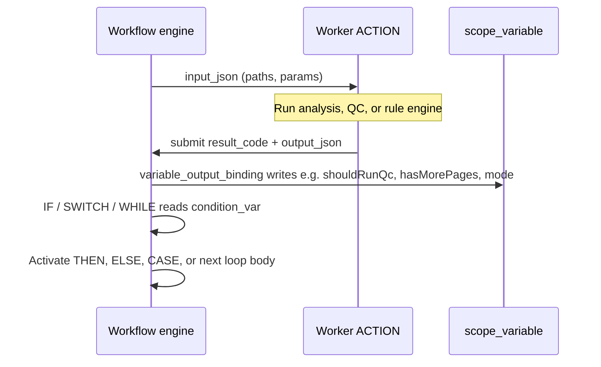
:::

::: {.content-visible when-format="pdf"}
```{=latex}
\begin{figure}[htbp]
\centering
\begin{adjustbox}{max width=\linewidth,center}
\begin{tikzpicture}[node distance=0.65cm and 0.55cm,
  every node/.style={transform shape},
  base/.style={draw, rounded corners=3pt, align=center, font=\footnotesize, minimum height=0.72cm, text width=2.6cm},
  arr/.style={-{Latex[length=2mm]}, thick},
  darr/.style={arr, dashed}]
\node[base, fill=orange!12] (e) {Workflow engine};
\node[base, fill=purple!10, right=1.3cm of e] (w) {Worker ACTION\\(QC, rules, \ldots)};
\node[base, fill=green!10, below=1.0cm of e] (s) {scope\_variable\\shouldRunQc, mode, \ldots};
\node[base, fill=orange!12, right=1.3cm of s] (cf) {IF / SWITCH / WHILE};
\draw[arr] (e)--node[above, font=\scriptsize]{input\_json}(w);
\draw[arr] (w)--node[right, font=\scriptsize]{result + output\_json}(e);
\draw[arr] (e)--node[left, font=\scriptsize]{output bindings}(s);
\draw[arr] (s)--(cf);
\draw[arr] (cf)--node[above, font=\scriptsize]{activate branch}(e);
\end{tikzpicture}
\end{adjustbox}
\caption{Worker-driven conditions: ACTION output updates scope, then control flow branches.}
\end{figure}
```
:::


**Example tree** (from Delphi reference seed `DelphiTreeFlow`):

- `GateIf` — `condition_var = shouldRunQc`: worker sets `1` to run QC, `0` to skip.
- `ModeSwitch` — `switch_var = mode`: worker chooses normalization branch (`1`, `2`, or default).
- `PollWhile` — `condition_var = hasMorePages`: pagination worker sets `1` until no pages remain, then `0`.

This keeps the **workflow graph static** while allowing arbitrarily complex predicates inside workers. Bindings can take either:

- **`source_kind = result_code`** — worker returns a signed integer directly.
- **`source_kind = output_path`** — worker returns JSON; engine extracts a field (e.g. `$.gate.passed`) into scope.

### Monte Carlo runs and stratified partitions

Monte Carlo validation ([`packages/methylvalidation`](/home/ubuntu/MethylPipeline/packages/methylvalidation/)) repeats the full pipeline on many **independent random splits** of the same cohorts. Each iteration:

1. Draws a **stratified partition** per cohort: fraction `train_fraction` (e.g. `0.8`) for training, remainder for validation.
2. Shuffles samples **within each cohort** independently (binary: control + disease; multiclass: K cohorts).
3. Materializes a **run-specific** `project.json` (train sample lists, validation CSVs, output under `monte_carlo_runs/run_XXXX/`).
4. Runs centroid → detector → … on that partition only.

Stratified split implementation: [`methyl_validation/split.py`](/home/ubuntu/MethylPipeline/packages/methylvalidation/methyl_validation/split.py) (`stratified_split`, `stratified_split_multiclass`). Planner: [`methyl_validation/planner.py`](/home/ubuntu/MethylPipeline/packages/methylvalidation/methyl_validation/planner.py).

#### Workflow engine bridge

Monte Carlo is represented explicitly in the DB, not only as filesystem artifacts:

| Table / object | Content |
|----------------|---------|
| `wf.monte_carlo_plan` | One row per instance: `base_project_path`, `layout`, `seed`, `feature_iterations`, `quality_iterations`, `config_json` |
| `wf.monte_carlo_run` | One row per planned iteration: `run_id`, `phase_name` (`feature` \| `quality`), `task_config_json` |
| Instance `context_json.monteCarlo` | Seeds plan metadata when the middle-tier starts an instance |

**Scoped variables for MC** (instance root and per-iteration):

| Variable | Meaning |
|----------|---------|
| `mc.enabled`, `mc.seed`, `mc.layout` | Plan metadata from `context_json` |
| `mc.featureIterations`, `mc.qualityIterations` | Loop bounds |
| `mc.phase`, `mc.phaseIteration`, `mc.runId` | Current iteration identity |
| `mc.taskConfig` | JSON descriptor for this run (project path, train/val lists, detector overrides) |

On ACTION activation, the engine **injects** `mc.taskConfig` into worker `input_json` (top-level payload or `mcTaskConfig` property) so centroid/detector workers receive the stratified partition for **that** iteration without re-rolling the split.

Schema migration: [`wf_monte_carlo_support.sql`](/home/ubuntu/MethylPipeline/workflow_engine/sql/wf_monte_carlo_support.sql).

#### Example workflow topology (`MethylValidationFlow`)

Seed: [`workflow_methylvalidation_seed.sql`](/home/ubuntu/MethylPipeline/workflow_engine/sql/workflow_methylvalidation_seed.sql)

::: {.content-visible when-format="html"}
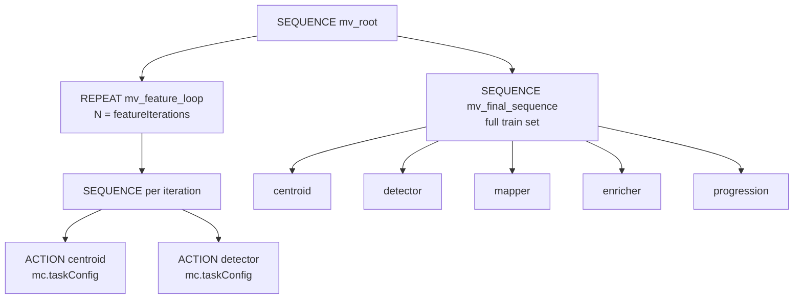
:::

::: {.content-visible when-format="pdf"}
```{=latex}
\begin{figure}[htbp]
\centering
\begin{adjustbox}{max width=\linewidth,center}
\begin{tikzpicture}[node distance=0.65cm and 0.55cm,
  every node/.style={transform shape},
  base/.style={draw, rounded corners=3pt, align=center, font=\footnotesize, minimum height=0.72cm, text width=2.6cm},
  arr/.style={-{Latex[length=2mm]}, thick},
  darr/.style={arr, dashed}]
\node[base] (root) {SEQUENCE mv\_root};
\node[base, below left=0.75cm and 0.2cm of root] (feat) {REPEAT feature loop\\$N$ iterations};
\node[base, below right=0.75cm and 0.2cm of root] (fin) {SEQUENCE final\\full sample set};
\node[base, below=0.55cm of feat] (fseq) {centroid $\rightarrow$ detector\\per mc.taskConfig};
\node[base, below=0.55cm of fin] (fpost) {centroid $\rightarrow$ detector $\rightarrow$\\mapper $\rightarrow$ enricher $\rightarrow$ progression};
\draw[arr] (root)--(feat); \draw[arr] (root)--(fin);
\draw[arr] (feat)--(fseq); \draw[arr] (fin)--(fpost);
\end{tikzpicture}
\end{adjustbox}
\caption{MethylValidationFlow: Monte Carlo feature loop then final full-sample pipeline.}
\end{figure}
```
:::


Each **REPEAT** body receives a distinct `mc.taskConfig` describing one stratified draw. The **final sequence** runs once on the full sample set after all feature-stability iterations complete.

**Future composition:** outer `REPEAT` (or `FOREACH` over `wf.monte_carlo_run` rows) × inner `FOREACH` over chromosomes/comparisons — see [`wf_foreach_design.md`](/home/ubuntu/MethylPipeline/workflow_engine/sql/wf_foreach_design.md).

Example `context_json` fragment for MC instances:

```json
{
  "monteCarlo": {
    "baseProject": "/work/study/project.json",
    "layout": "binary",
    "seed": 42,
    "featureIterations": 30,
    "qualityIterations": 20
  }
}
```

Project-level MC parameters also live under `step_config.validation` in the portal schema (`validation_monte_carlo` in [`validation.schema.json`](/home/ubuntu/MethylPipeline/schemas/config/validation.schema.json)): `train_fraction`, `n_iterations`, cohort CSVs, and regulatory metadata.

### Cluster metadata in DB

```sql
wf.cluster (
  cluster_key, name, provider,
  shared_storage_uri,    -- e.g. file://share or https://...
  worker_mount_path,     -- default '/work'
  status
)
```

Workers register against a cluster; capabilities are stored on `wf.worker.capabilities` (JSON).

---

## 5. Two-group example: config → workflow tree

This section ties **one control vs two disease groups** (OvR-style) to the **`DataDrivenPipeline`** workflow definition and a concrete `context_json`.

### 5.1 Project intent (PCa3-style)

| Item | Value |
|------|--------|
| Control | `controls.all` |
| Disease stages | e.g. `PCa_Low`, `PCa_High` (two comparisons) |
| Context | `CG` |
| Chromosomes | 24 (`1`–`22`, `X`, `Y`) |
| Comparisons shorthand | `control_vs_each_disease` |

Resolved directories (under `/work/prostate-cancer/PCa3/`):

- Centroids control: `centroids/controls/healthy/all`
- Centroids disease: `centroids/diseases/cancer/{PCa_Low|PCa_High}`
- Detections: `detections/all/{PCa_Low|PCa_High}`

### 5.2 Instance `context_json` (runtime)

From [`workflow_engine/sql/instance_context_examples/pca_ovr.json`](/home/ubuntu/MethylPipeline/workflow_engine/sql/instance_context_examples/pca_ovr.json):

```json
{
  "projectPath": "/home/ubuntu/Work/prostate-cancer/configs/project_PCa3.json",
  "context": "CG",
  "centroid1Dir": "/work/prostate-cancer/PCa3/centroids/controls/healthy/all",
  "group1Label": "group1",
  "orderedComparisonLabels": ["PCa_Low", "PCa_High"],
  "chromosomes": ["1", "2", "...", "22", "X", "Y"],
  "comparisons": [
    {
      "label": "PCa_Low",
      "centroid2Dir": "/work/prostate-cancer/PCa3/centroids/diseases/cancer/PCa_Low",
      "detectOutDir": "/work/prostate-cancer/PCa3/detections/all/PCa_Low",
      "group2Label": "group2"
    },
    {
      "label": "PCa_High",
      "centroid2Dir": "/work/prostate-cancer/PCa3/centroids/diseases/cancer/PCa_High",
      "detectOutDir": "/work/prostate-cancer/PCa3/detections/all/PCa_High",
      "group2Label": "group2"
    }
  ]
}
```

No per-chromosome nodes are stored in the DB — only **~15 static nodes** in `DataDrivenPipeline`; fan-out is entirely data-driven.

### 5.3 Workflow tree (`DataDrivenPipeline`)

Seed: [`workflow_engine/sql/wf_data_driven_pipeline_seed.sql`](/home/ubuntu/MethylPipeline/workflow_engine/sql/wf_data_driven_pipeline_seed.sql)

::: {.content-visible when-format="html"}
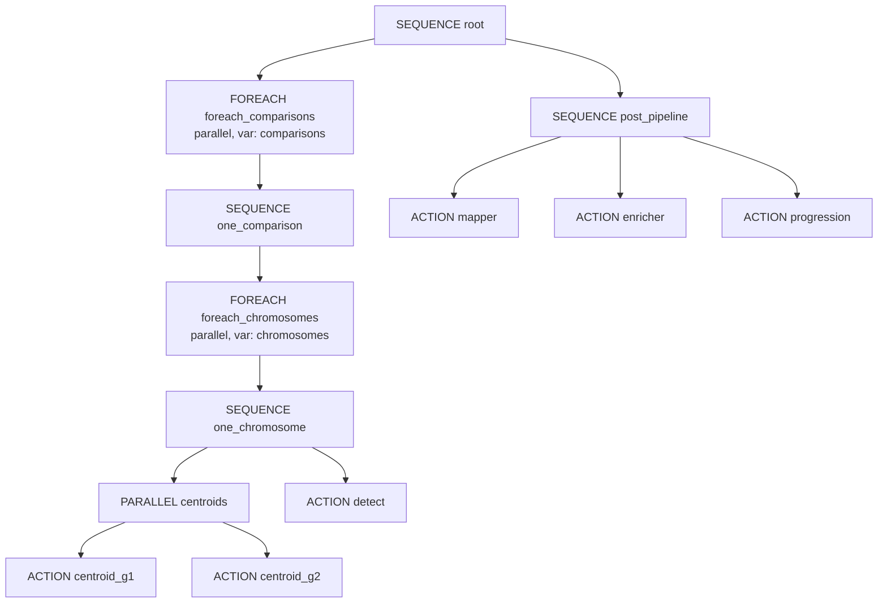
:::

::: {.content-visible when-format="pdf"}
```{=latex}
\begin{figure}[htbp]
\centering
\begin{adjustbox}{max width=\linewidth,center}
\begin{tikzpicture}[node distance=0.65cm and 0.55cm,
  every node/.style={transform shape},
  base/.style={draw, rounded corners=3pt, align=center, font=\footnotesize, minimum height=0.72cm, text width=2.6cm},
  arr/.style={-{Latex[length=2mm]}, thick},
  darr/.style={arr, dashed}]
\node[base] (root) {SEQUENCE root};
\node[base, below left=0.8cm and 0.15cm of root] (fecp) {FOREACH comparisons\\(parallel)};
\node[base, below right=0.8cm and 0.15cm of root] (post) {SEQUENCE post\_pipeline\\mapper, enricher, progression};
\node[base, below=0.55cm of fecp] (seqcmp) {SEQUENCE one\_comparison};
\node[base, below=0.55cm of seqcmp] (fechr) {FOREACH chromosomes\\(parallel)};
\node[base, below=0.55cm of fechr] (seqchr) {SEQUENCE one\_chromosome};
\node[base, below left=0.55cm and 0.1cm of seqchr] (par) {PARALLEL\\centroid\_g1, centroid\_g2};
\node[base, below right=0.55cm and 0.1cm of seqchr] (det) {ACTION detect};
\draw[arr] (root)--(fecp); \draw[arr] (root)--(post);
\draw[arr] (fecp)--(seqcmp); \draw[arr] (seqcmp)--(fechr);
\draw[arr] (fechr)--(seqchr); \draw[arr] (seqchr)--(par); \draw[arr] (seqchr)--(det);
\end{tikzpicture}
\end{adjustbox}
\caption{DataDrivenPipeline workflow tree (static nodes, data-driven fan-out).}
\end{figure}
```
:::


### 5.4 Per-chromosome dependency (one comparison)

```text
one_chromosome (SEQUENCE)
├─ PARALLEL centroids
│  ├─ centroid_g1  (methyl-centroid → centroid1Dir)
│  └─ centroid_g2  (methyl-centroid → centroid2Dir)
└─ detect         (methyl-detector → detectOutDir)
```

`detect` runs only after **both** centroids for that chromosome succeed (PARALLEL parent must complete first).

### 5.5 Execution scale (PCa OvR example)

| Phase | Count |
|-------|------:|
| Comparisons (parallel) | 2 |
| Chromosomes per comparison | 24 |
| Actions per chromosome | 3 (2 centroids + 1 detect) |
| **Subtotal ACTION tasks** | **2 × 24 × 3 = 144** |
| Post-pipeline (sequential) | mapper + enricher + progression = **3** |
| **Total ACTION executions** | **147** |

Post steps run only after **all** comparison branches complete (root `SEQUENCE`: fan-out then post_pipeline).

### 5.6 Input templates (resolved at claim time)

| Node | Resolved `input_json` fields |
|------|---------------------------|
| `centroid_g1` | `project`, `group`, `chromosome`, `context`, `comparison`, `outputDir` → `centroid1Dir` |
| `centroid_g2` | same with `centroid2Dir` |
| `detect` | `project`, `chromosome`, `centroid1Dir`, `centroid2Dir`, `outputDir` |
| `mapper` / `enricher` | `project` only (reads detection outputs from shared storage) |
| `progression` | `project`, `orderedComparisonLabels` |

Worker contracts: [`workflow_engine/sql/wf_worker_contracts_pca_ovr.md`](/home/ubuntu/MethylPipeline/workflow_engine/sql/wf_worker_contracts_pca_ovr.md)

---

## 6. Worker protocol and middle-tier

Workers **never connect to the database directly**. They use the REST API (or an equivalent gateway) documented in [`contracts/openapi.yaml`](/home/ubuntu/MethylPipeline/contracts/openapi.yaml) and [`workflow_engine/WORKER_PROTOCOL.md`](/home/ubuntu/MethylPipeline/workflow_engine/WORKER_PROTOCOL.md).

### REST endpoints

| Method | Path | Caller |
|--------|------|--------|
| `POST` | `/v1/workers/authenticate` | Worker registration |
| `POST` | `/v1/workers/tasks/request` | Worker poll loop |
| `POST` | `/v1/workers/tasks/{id}/submit` | Task completion |
| `POST` | `/v1/workers/tasks/{id}/heartbeat` | Long-running jobs |
| `POST` | `/v1/workers/tasks/{id}/fail` | Explicit failure |
| `POST` | `/v1/workflows/instances` | Portal / admin |
| `GET` | `/v1/workflows/instances/{id}` | Portal status |

Implementation: [`workflow_engine/src/WfEngine.RestApi.pas`](/home/ubuntu/MethylPipeline/workflow_engine/src/WfEngine.RestApi.pas), served by [`WfEngine.RestHttpServer.pas`](/home/ubuntu/MethylPipeline/workflow_engine/src/WfEngine.RestHttpServer.pas) (default port **8080**).

Python gateway (PostgreSQL parity testing): [`workflow_engine/rest/gateway.py`](/home/ubuntu/MethylPipeline/workflow_engine/rest/gateway.py).

### Request / submit sequence

::: {.content-visible when-format="html"}
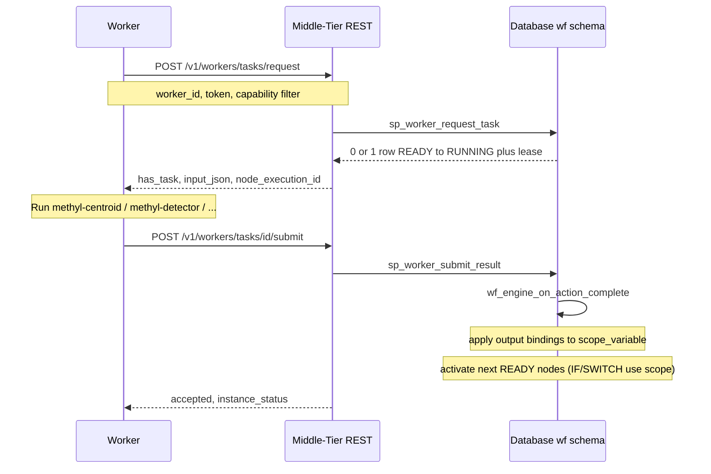
:::

::: {.content-visible when-format="pdf"}
```{=latex}
\begin{figure}[htbp]
\centering
\begin{adjustbox}{max width=\linewidth,center}
\begin{tikzpicture}[node distance=0.65cm and 0.55cm,
  every node/.style={transform shape},
  base/.style={draw, rounded corners=3pt, align=center, font=\footnotesize, minimum height=0.72cm, text width=2.6cm},
  arr/.style={-{Latex[length=2mm]}, thick},
  darr/.style={arr, dashed}]
\node[base, fill=purple!10] (w) {Worker node};
\node[base, fill=orange!12, right=1.1cm of w] (mt) {Middle-tier REST};
\node[base, fill=green!10, right=1.1cm of mt] (db) {Database (wf)};
\draw[arr] (w)--node[above, font=\scriptsize]{POST /tasks/request}(mt);
\draw[arr] (mt)--node[above, font=\scriptsize]{sp\_worker\_request\_task}(db);
\draw[arr] (db)--node[below, font=\scriptsize]{input\_json + lease}(mt);
\draw[arr] (mt)--node[below, font=\scriptsize]{has\_task}(w);
\draw[arr] (w)--node[above, font=\scriptsize]{POST /tasks/\{id\}/submit}(mt);
\draw[arr] (mt)--node[above, font=\scriptsize]{wf\_engine\_on\_action\_complete}(db);
\end{tikzpicture}
\end{adjustbox}
\caption{Worker poll / submit protocol via stateless middle-tier.}
\end{figure}
```
:::


### Middle-tier responsibilities

| Component | Role |
|-----------|------|
| **`WfEngine.RestHttpServer`** | HTTP → `TRestApiService.Handle` |
| **`TRestApiService`** | Auth, JSON parse, call `sp_*` or Delphi engine path |
| **`TWorkflowEngine` / SQL procs** | Activate graph, resolve templates, advance control flow |
| **`TWorkflowEngineHostedService.RunUntilStopped`** | Observability tick only — **does not dispatch tasks** |

**State:** All workflow progress lives in the database (`node_execution.status`, `task_lease`, `scope_variable`). The middle-tier is **stateless** between HTTP calls.

### Capability matching

| `workflow_action` | Capability string | Worker advertises |
|-------------------|-------------------|-------------------|
| `pipeline.centroid` | `methyl-centroid` | `methyl-centroid` |
| `pipeline.detector` | `methyl-detector` | `methyl-detector` |
| `pipeline.mapper` | `methyl-mapper` | `methyl-mapper` |
| `pipeline.enricher` | `methyl-enricher` | `methyl-enricher` |
| `pipeline.progression` | `methyl-disease-progression` | `methyl-disease-progression` |

`sp_worker_request_task` claims the oldest `READY` row matching the worker’s capability (optional filter), using `FOR UPDATE SKIP LOCKED` on PostgreSQL for safe concurrent polling.

---

## 7. Cluster and shared storage model

Distributed processing assumes **all worker nodes see the same filesystem** at a common mount point, conventionally **`/work`**, recorded in `wf.cluster.worker_mount_path` and optionally `shared_storage_uri`.

### Assumptions

1. **Shared storage:** NFS, Azure Files, or equivalent mounted at `/work` on every compute node.
2. **Path contract:** `input_json` carries absolute paths under that mount (`centroid1Dir`, `detectOutDir`, …). Workers read and write files directly; the DB stores paths, not file bytes.
3. **No worker-to-worker RPC:** Dependencies are enforced only by the workflow tree (e.g. `detect` after both centroids for the same chromosome).
4. **Maximize parallelism:** Outer `FOREACH` over comparisons and inner `FOREACH` over chromosomes both use **`foreach_parallel = 1`**, so up to `len(comparisons) × len(chromosomes)` centroid pairs and detections can run concurrently, bounded by worker count.
5. **Serialization within a chromosome:** For each `(comparison, chromosome)`, detect waits for both centroids — the only mandatory per-chromosome barrier.
6. **Post-pipeline barrier:** Mapper, enricher, and progression run only after **all** detection tasks complete (second child of root `SEQUENCE`).

### Architecture diagram

::: {.content-visible when-format="html"}
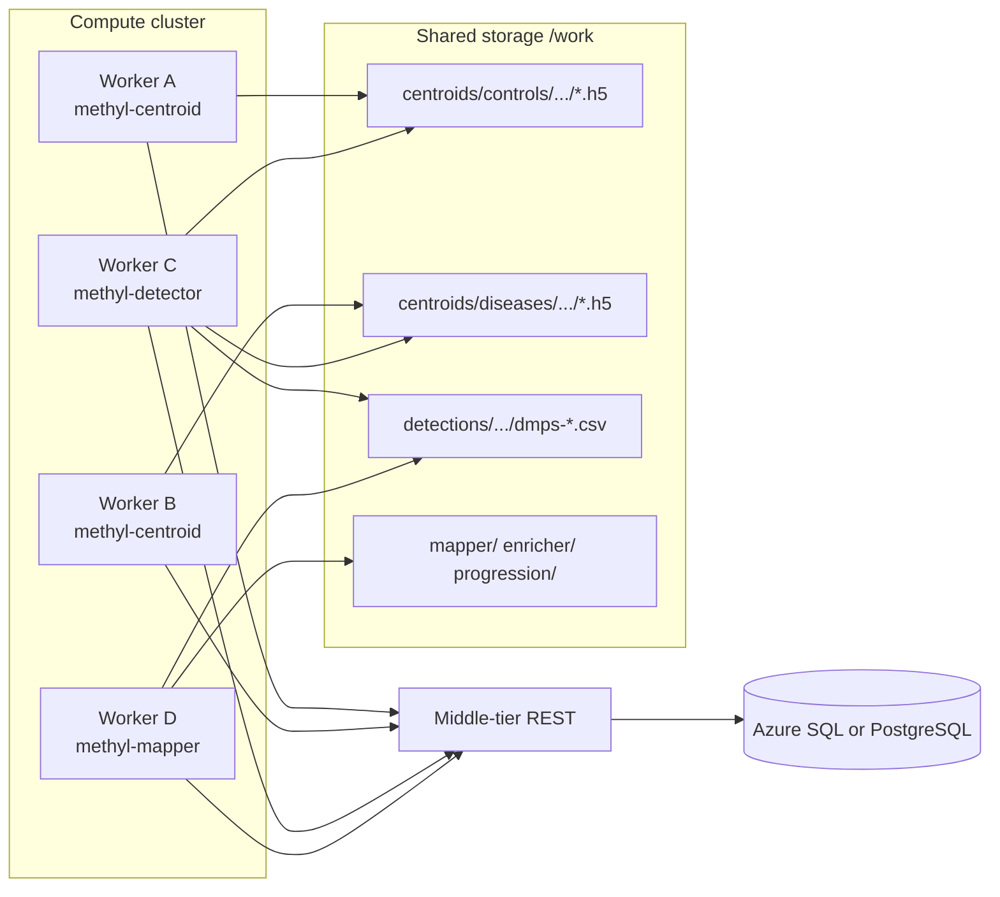
:::

::: {.content-visible when-format="pdf"}
```{=latex}
\begin{figure}[htbp]
\centering
\begin{adjustbox}{max width=\linewidth,center}
\begin{tikzpicture}[node distance=0.65cm and 0.55cm,
  every node/.style={transform shape},
  base/.style={draw, rounded corners=3pt, align=center, font=\footnotesize, minimum height=0.72cm, text width=2.6cm},
  arr/.style={-{Latex[length=2mm]}, thick},
  darr/.style={arr, dashed}]
\node[base] (n1) {methyl-centroid\\worker};
\node[base, right=0.35cm of n1] (n2) {methyl-detector\\worker};
\node[base, right=0.35cm of n2] (n3) {methyl-mapper\\worker};
\node[base, fill=gray!12, below=1.1cm of n2, text width=3.4cm] (stor) {Shared /work mount\\centroids, detections, mapper outputs};
\node[base, fill=orange!12, above=1.0cm of n2] (mt) {Middle-tier REST};
\node[base, fill=green!10, left=1.3cm of mt] (db) {Database};
\draw[arr] (n1)--(stor); \draw[arr] (n2)--(stor); \draw[arr] (n3)--(stor);
\draw[arr] (n1)--(mt); \draw[arr] (n2)--(mt); \draw[arr] (n3)--(mt);
\draw[arr] (mt)--(db);
\end{tikzpicture}
\end{adjustbox}
\caption{Cluster workers share NFS/Azure Files storage; coordination via database only.}
\end{figure}
```
:::


### Minimizing total processing time

| Technique | Effect |
|-----------|--------|
| Per-chromosome parallelism | 24 chromosomes per comparison run concurrently |
| Per-comparison parallelism | Multiple disease groups run concurrently |
| Capability-specific workers | Centroid-heavy and detector-heavy nodes scale independently |
| `SKIP LOCKED` task claim | Many workers poll without blocking each other |
| Shared output paths | Centroid output for chr *N* is input to detect for chr *N* on the same mount — no data shipping between nodes |

### Portal + planner + engine (end-to-end)

```text
1. User edits project.json in portal (schema-validated)
2. Planner builds context_json (comparisons[], chromosomes[], dirs)
3. Portal POST /v1/workflows/instances { workflow_version_id, context_json }
4. Engine activates DataDrivenPipeline → thousands of READY rows materialized logically
5. Workers on cluster pull tasks, read/write /work/..., submit results
6. Instance status → COMPLETED when root SEQUENCE finishes
```

---

## Further reading

| Document | Topic |
|----------|--------|
| [`workflow_engine/sql/DataDrivenPipeline.md`](/home/ubuntu/MethylPipeline/workflow_engine/sql/DataDrivenPipeline.md) | FOREACH workflow, deploy order |
| [`workflow_engine/WORKFLOW_ENGINE_DELPHI.md`](/home/ubuntu/MethylPipeline/workflow_engine/WORKFLOW_ENGINE_DELPHI.md) | Scope variables, IF/SWITCH/WHILE, Monte Carlo bridge |
| [`workflow_engine/CAPABILITY_CHECK.md`](/home/ubuntu/MethylPipeline/workflow_engine/CAPABILITY_CHECK.md) | Engine capabilities vs gaps |
| [`docs/theory/chapters/05-methylpredictor-and-validation.qmd`](/home/ubuntu/MethylPipeline/docs/theory/chapters/05-methylpredictor-and-validation.qmd) | Theory: Monte Carlo splits and validation |
| [`docs/theory/chapters/11-project-configuration.qmd`](/home/ubuntu/MethylPipeline/docs/theory/chapters/11-project-configuration.qmd) | Theory: project configuration |
| [`tools/methyl-config-editor/README.md`](/home/ubuntu/MethylPipeline/tools/methyl-config-editor/README.md) | Config editor setup |
| [`workflow_engine/README.md`](/home/ubuntu/MethylPipeline/workflow_engine/README.md) | SQL deploy order |

---

*Document version: aligns with `DataDrivenPipeline` seed, `FOREACH` engine support, scoped-variable write-path parity, and Monte Carlo plan/run tables.*

---

## Rendering this document

Edit [`pipeline_architecture.md`](pipeline_architecture.md), regenerate the Quarto source, then render locally:

```bash
python workflow_engine/docs/build_pipeline_architecture_qmd.py

# HTML — use preview (recommended); Mermaid needs HTTP + JavaScript
quarto preview workflow_engine/docs/pipeline_architecture.qmd

# Or use the helper script from the repo root:
bash workflow_engine/docs/render-pipeline-architecture.sh preview

# PDF — vector TikZ figures (requires TeX / lualatex)
quarto render workflow_engine/docs/pipeline_architecture.qmd --to pdf
# bash workflow_engine/docs/render-pipeline-architecture.sh pdf
```

**HTML:** Open the URL that `quarto preview` prints (typically `http://localhost:…`) in your normal browser. Do **not** open `pipeline_architecture.html` directly from disk (`file://`) or in the IDE Markdown/HTML preview — Mermaid will not run and you will see raw diagram source (`erDiagram`, `flowchart`, etc.).

**PDF:** Uses TikZ figures (same approach as [`docs/MethylPipeline-overview.qmd`](../../docs/MethylPipeline-overview.qmd)). Install TeX if needed: `quarto install tinytex`.

